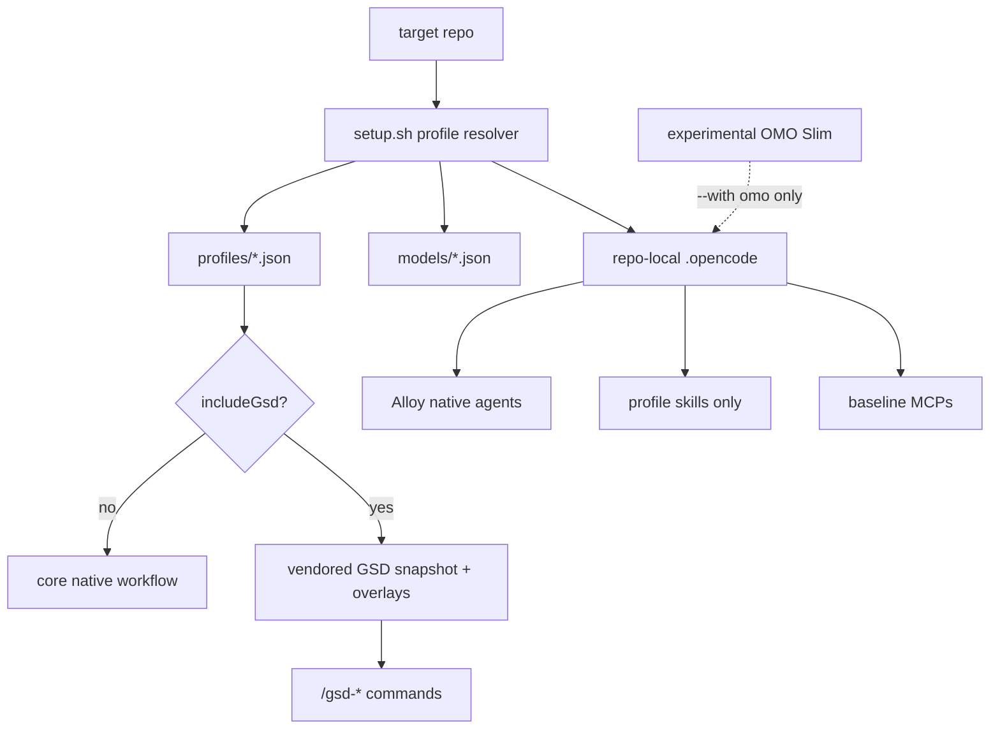

# OpenCode Alloy

OpenCode Alloy is a profile-based OpenCode distribution for multi-repo teams. It installs only the agents, skills, commands, MCPs, and model role mappings a target repo needs.

The intended repo slug is `opencode-alloy`.

## Quick Start

```bash
bash setup.sh --profile core --target local --models github-copilot
```

Defaults:

- target is local, so files are generated under the current repo's `.opencode/`
- no network access
- no `npx skills add`
- no default OMO Slim runtime or plugin
- MCP baseline is `context7`, `grep_app`, and `exa`

## Profiles

| Profile | Use For | Adds |
|---|---|---|
| `core` | any repo | Alloy agents, Alloy skills, shared commands, baseline MCPs |
| `frontend` | UI/web repos | core plus frontend and browser verification skills |
| `backend` | API/service/data repos | core plus Kotlin/JPA and Postgres skills |
| `infra` | Terraform/OpenTofu/cloud repos | core plus infra skill |
| `workflow-gsd` | complex planned work | core plus project-local vendored GSD commands/agents/workflows |
| `all` | local power-user repo | every vendored profile plus GSD |

Examples:

```bash
bash setup.sh --profile frontend --target local --models github-copilot
bash setup.sh --profile backend --target local --models openai
bash setup.sh --profile workflow-gsd --target local --models github-copilot
```

## Operating Model



Alloy absorbs OMO Slim's useful idea, role-specific model routing, into native OpenCode agents:

- `alloy-orchestrator`
- `alloy-planner`
- `alloy-executor`
- `alloy-reviewer`
- `alloy-debugger`
- `alloy-verifier`

## Skills

Alloy-owned skills:

- `alloy-tdd`: unified implementation loop, incorporating Superpowers TDD behavior
- `alloy-brainstorm`: product/design/system brainstorming, sourced from Superpowers brainstorming
- `alloy-debug`: systematic debugging, sourced from Superpowers systematic debugging

Profile skills are explicit. Alloy does not install `skills: ["*"]` defaults.

## Vendor Policy

Alloy uses Hybrid Vendor + Snapshot Overlay:

- `vendor/` contains runtime or prompt content needed for offline installation.
- `overlays/` contains Alloy modifications. We do not directly fork-edit upstream GSD prompt/runtime files.
- `vendor.lock.json` records source, version, license, vendored paths, and hashes.
- `third_party_notices/` explains bundled third-party content.

GSD is locked at `gsd-opencode@1.38.5` and only installed for `workflow-gsd` or `all`.

OMO Slim is experimental. Its sample config lives under `experimental/omo-slim/` and is only copied with `--with omo`.

## Checks

```bash
bash setup.sh --dry-run --profile core --target local
bash setup.sh --dry-run --profile workflow-gsd --target local
bash setup.sh --doctor --profile core --target local
python3 -m unittest scripts.test_audit_prompt_dependencies
```
