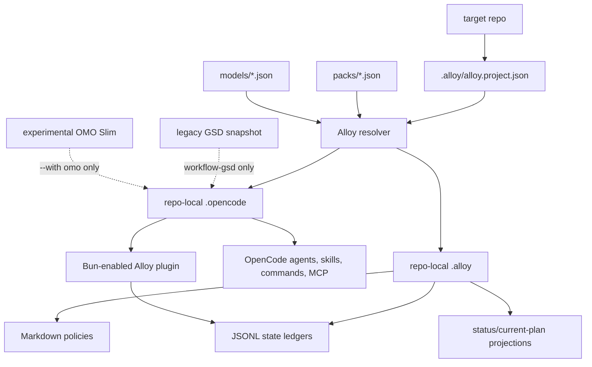

# OpenCode Alloy

OpenCode Alloy is an OpenCode-native control layer for multi-repo teams. It resolves repo-local packs, installs the right agents and skills, keeps workflow policy in Markdown, records state in JSONL ledgers, and connects to OpenCode through a Bun-enabled local plugin.

The intended repo slug is `opencode-alloy`.

## Quick Start

```bash
bash setup.sh --pack core --target local --models github-copilot
```

Equivalent direct CLI:

```bash
node bin/alloy.mjs install --pack core --target local --models github-copilot
```

Defaults:

- target is local, so files are generated under the current repo's `.opencode/`
- `.alloy/` is created for project config, Markdown policies, JSONL state, and projections
- Node and Bun are required by default
- no `npx skills add`
- no default OMO Slim runtime or plugin
- no default full GSD runtime
- MCP baseline is `context7`, `grep_app`, and `exa`

## Packs

Packs replace the old user-facing "profile" concept. `--profile` still works as a deprecated alias for `--pack`.

| Pack | Use For | Adds |
|---|---|---|
| `core` | any repo | Alloy agents, core skills, shared commands, baseline MCPs, Alloy plugin |
| `frontend` | UI/web repos | core plus frontend and browser verification skills |
| `backend` | API/service/data repos | core plus Kotlin/JPA and Postgres skills |
| `infra` | Terraform/OpenTofu/cloud repos | core plus infra skill |
| `workflow` | stateful Alloy workflow | alias-style pack for repos that want to name the standard `.alloy` workflow explicitly |
| `all` | local power-user repo | every first-party and licensed third-party skill, without legacy GSD by default |
| `workflow-gsd` | legacy planned work | core plus project-local vendored GSD commands/agents/workflows |

Examples:

```bash
bash setup.sh --pack frontend --target local --models github-copilot
bash setup.sh --pack backend --target local --models openai
bash setup.sh --pack workflow-gsd --target local --models github-copilot
```

## Operating Model



Boundaries:

- OpenCode is the runtime, agent host, tool host, MCP host, and plugin host.
- Alloy SDK/CLI resolves config, installs files, records state, checks gates, and runs doctor.
- Alloy plugin adapts OpenCode hooks into Alloy evidence, permission, and event ledgers.
- GSD, OMO Slim, and Superpowers are upstream idea sources; they are not default runtimes.

## Project Model

Alloy installs a repo-local project model:

```text
.alloy/
  alloy.project.json
  workflow.md
  policies/
    claims.md
    tdd.md
    review.md
    debug.md
  state/
    tasks.jsonl
    claims.jsonl
    evidence.jsonl
    runs.jsonl
  projections/
    status.md
    current-plan.md
```

Markdown files are human/agent-readable workflow policy. JSON and JSONL files are machine-readable source of truth.

## CLI

```bash
node bin/alloy.mjs init --pack frontend
node bin/alloy.mjs resolve --pack frontend --json
node bin/alloy.mjs install --pack frontend --target local
node bin/alloy.mjs doctor --pack frontend --target local
node bin/alloy.mjs state add-task --title "Add login form" --kind code
node bin/alloy.mjs gate check --task-id <id> --json
node bin/alloy.mjs sync --workspace alloy.workspace.json --dry-run
```

## Skills

Alloy-owned skills:

- `alloy-tdd`: unified implementation loop, incorporating Superpowers TDD behavior
- `alloy-brainstorm`: product/design/system brainstorming, sourced from Superpowers brainstorming
- `alloy-debug`: systematic debugging, sourced from Superpowers systematic debugging

Pack skills are explicit. Alloy does not install `skills: ["*"]` defaults.

## Vendor Policy

Alloy uses Hybrid Vendor + Snapshot Overlay:

- `vendor/` contains runtime or prompt content needed for offline installation.
- `overlays/` contains Alloy modifications. We do not directly fork-edit upstream GSD prompt/runtime files.
- `vendor.lock.json` records source, version, license, vendored paths, and hashes.
- `third_party_notices/` explains bundled third-party content.

GSD is locked at `gsd-opencode@1.38.5` and only installed for `workflow-gsd` or explicit `--with gsd` opt-in.

OMO Slim is experimental. Its sample config lives under `experimental/omo-slim/` and is only copied with `--with omo`.

## Checks

```bash
bash setup.sh --dry-run --pack core --target local
bash setup.sh --dry-run --pack workflow-gsd --target local
bash setup.sh --doctor --pack core --target local
npm test
```
