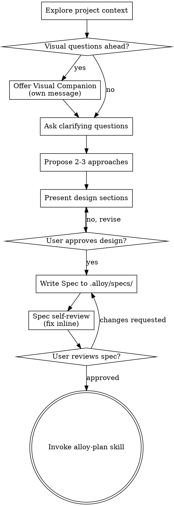

# Alloy Brainstorm

Help turn ideas into fully formed designs and specs through natural collaborative dialogue.

Start by understanding the current project context, then ask questions one at a time to refine the idea. Once you understand what you're building, present the design and get user approval.

<HARD-GATE>
Do NOT invoke any implementation skill, write any code, scaffold any project, or take any implementation action until you have presented a design AND the user has approved it. This applies to EVERY project regardless of perceived simplicity.

The terminal state of brainstorming is invoking `alloy-plan`. Do NOT skip ahead to `alloy-execute` or `alloy-tdd`.
</HARD-GATE>

## Anti-Pattern: "This Is Too Simple To Need A Design"

Every project goes through this process. A todo list, a single-function utility, a config change — all of them. "Simple" projects are where unexamined assumptions cause the most wasted work. The design can be short (a few sentences for truly simple projects), but you MUST present it and get approval.

## Checklist

You MUST create a todo for each of these and complete them in order:

1. **Explore project context** — check files, docs, `.alloy/specs/`, recent commits
2. **Offer visual companion** (if topic involves visual questions) — own message, not combined with a question
3. **Ask clarifying questions** — one at a time; understand purpose, constraints, success criteria
4. **Propose 2–3 approaches** — with trade-offs and your recommendation
5. **Present design** — in sections scaled to their complexity; get user approval after each section
6. **Write design doc** — save to `.alloy/specs/YYYY-MM-DD-<topic>/task_plan.md` with `## Spec` section filled in
7. **Spec self-review** — quick inline check (placeholders, contradictions, ambiguity, scope)
8. **User reviews written spec** — ask user to review before proceeding
9. **Hand off to `alloy-plan`** — invoke to create the `## Plan` section + implementation tasks

## Process Flow



## The Process

### Understanding the Idea

- Check current project state first: files, docs, `.alloy/specs/`, recent commits, existing patterns
- **Before asking detailed questions, assess scope.** If the request describes multiple independent subsystems (e.g., "build a platform with chat, file storage, billing, and analytics"), flag this immediately. Don't refine details of a project that needs decomposition first.
- If the project is too large for a single spec, help the user decompose into sub-projects: what are the independent pieces, how do they relate, what order to build them. Then brainstorm the first sub-project. Each sub-project gets its own spec → plan → implementation cycle.
- For appropriately-scoped projects, ask questions one at a time.
- Prefer multiple choice when possible. Open-ended is fine too.
- **Only one question per message.** If a topic needs more exploration, break it into multiple questions.
- Focus on: purpose, constraints, success criteria.

### Exploring Approaches

- Propose 2–3 different approaches with trade-offs
- Present options conversationally with your recommendation and reasoning
- Lead with your recommended option and explain why

### Presenting the Design

- Once you believe you understand what you're building, present the design
- Scale each section to its complexity: a few sentences if straightforward, up to 200–300 words if nuanced
- Ask after each section whether it looks right
- Cover: architecture, components, data flow, error handling, testing approach
- Be ready to go back and clarify if something doesn't make sense

### Design for Isolation and Clarity

- Break the system into smaller units that each have one clear purpose, communicate through well-defined interfaces, and can be understood and tested independently
- For each unit, you should be able to answer: what does it do, how do you use it, what does it depend on?
- Can someone understand what a unit does without reading its internals? Can you change the internals without breaking consumers? If not, the boundaries need work.
- Smaller, well-bounded units are easier for agents to work with — you reason better about code you can hold in context, and your edits are more reliable when files are focused. Large files = doing too much.

### Working in Existing Codebases

- Explore the current structure before proposing changes. Follow existing patterns.
- Where existing code has problems that affect the work (file too large, unclear boundaries, tangled responsibilities), include targeted improvements as part of the design — the way a good developer improves code they're working in.
- Don't propose unrelated refactoring. Stay focused on what serves the current goal.

## Spec Output

Write the validated design to `.alloy/specs/YYYY-MM-DD-<topic>/task_plan.md` with this structure:

```markdown
# <Topic>

## Spec   ← This is the brainstorm output

### Why
<problem statement, current pain, scope>

### What users will do
<concrete user flow>

### Acceptance criteria
- <observable, testable criteria>
- ...

### Out of scope
- <things we explicitly aren't doing>

## Plan   ← alloy-plan fills this in next phase
TBD
```

**The `## Spec` section is what you produce. The `## Plan` section is what `alloy-plan` produces next.**

## Spec Self-Review

After writing the spec, look at it with fresh eyes:

1. **Placeholder scan:** Any "TBD", "TODO", incomplete sections, or vague requirements? Fix them.
2. **Internal consistency:** Do any sections contradict each other? Does the architecture match the feature descriptions?
3. **Scope check:** Is this focused enough for a single implementation plan, or does it need decomposition?
4. **Ambiguity check:** Could any requirement be interpreted two different ways? If so, pick one and make it explicit.

Fix issues inline. No need to re-review — just fix and move on.

## User Review Gate

After self-review passes:

> "Spec written to `.alloy/specs/<id>/task_plan.md`. Please review the `## Spec` section and let me know if you want changes before we move to `## Plan`."

Wait for user response. If they request changes, make them and re-run self-review. Only proceed once the user approves.

## Hand Off

**The terminal state is invoking `alloy-plan`.** Do NOT invoke `alloy-execute`, `alloy-tdd`, or `frontend-design`. The ONLY skill you invoke after brainstorming is `alloy-plan`.

## Key Principles

- **One question at a time** — Don't overwhelm
- **Multiple choice preferred** — Easier to answer than open-ended when possible
- **YAGNI ruthlessly** — Remove unnecessary features from all designs
- **Explore alternatives** — Always propose 2–3 approaches before settling
- **Incremental validation** — Present design, get approval before moving on
- **Be flexible** — Go back and clarify when something doesn't make sense

## Visual Companion

A browser-based companion for showing mockups, diagrams, and visual options. Available as a tool — not a mode. Accepting the companion means it's available for questions that benefit from visual treatment; it does NOT mean every question goes through the browser.

**Offering the companion:** When you anticipate that upcoming questions involve visual content, offer it once for consent. This offer MUST be its own message — do not combine it with clarifying questions, summaries, or any other content. Wait for the user's response.

**Per-question decision:** Even after the user accepts, decide FOR EACH QUESTION whether to use the browser or the terminal. Test: would the user understand this better by seeing it than reading it?

- **Use the browser** for mockups, wireframes, layout comparisons, architecture diagrams
- **Use the terminal** for requirements questions, conceptual choices, tradeoff lists, scope decisions

A question about a UI topic is not automatically a visual question. "What does personality mean in this context?" is conceptual — terminal. "Which wizard layout works better?" is visual — browser.

## Evidence

The plugin auto-records that you ran `alloy-brainstorm`. Explicitly:

```
alloy_evidence { kind: "brainstorm_done", taskId, summary: "Spec written to .alloy/specs/<id>/task_plan.md, user approved" }
```

`alloy gate check` for `code` tasks requires the spec file to exist before `/plan` can proceed.

## Attribution

Fuses:
- **obra/superpowers** brainstorming — HARD-GATE, anti-pattern naming, design isolation principles, visual companion concept, spec self-review (MIT)
- **Alloy** — `.alloy/specs/<id>/task_plan.md` artifact location with `## Spec` / `## Plan` section convention, hand-off to alloy-plan, evidence integration
