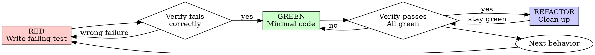

# Alloy TDD

## The Iron Law

```
NO PRODUCTION CODE WITHOUT A FAILING TEST FIRST
```

Code written before tests → **delete it**. Not "keep as reference", not "adapt while writing tests", not "look at it". **Delete means delete.** Implement fresh from tests.

**Core principle:** If you didn't watch the test fail, you don't know if it tests the right thing.

**Violating the letter of the rules is violating the spirit of the rules.**

## When to Use

**Always:**
- New features
- Bug fixes
- Refactoring
- Behavior changes

**Exceptions** (ask user first):
- Throwaway prototypes
- Generated code
- Configuration files
- Pure documentation changes

Thinking "skip TDD just this once"? Stop. That's rationalization.

## Anti-Pattern: Horizontal Slicing

**DO NOT write all tests first, then all implementation.**

This is "horizontal slicing" — treating RED as "write all tests" and GREEN as "write all code." It produces **crap tests**:
- Tests written in bulk test *imagined* behavior, not *actual* behavior
- You end up testing the *shape* (data structures, signatures) rather than user-facing behavior
- Tests become insensitive to real changes
- You outrun your headlights, committing to test structure before understanding implementation

**Correct approach:** Vertical slicing via tracer bullets.

```
WRONG (horizontal):
  RED:   test1, test2, test3, test4, test5
  GREEN: impl1, impl2, impl3, impl4, impl5

RIGHT (vertical):
  RED→GREEN: test1→impl1
  RED→GREEN: test2→impl2
  RED→GREEN: test3→impl3
```

One test responds to what you learned from the previous cycle.

## Workflow

### 0. Design First

Before writing ANY code (test or impl):
- [ ] Confirm with user: what interface changes needed?
- [ ] Confirm with user: which behaviors to test (prioritize)?
- [ ] List behaviors to test (NOT implementation steps)
- [ ] Get user approval on the list

You can't test everything. Confirm what matters most. Focus on critical paths and complex logic, not every edge case.

### 1. Tracer Bullet

Write ONE test confirming ONE thing about the system:

```
RED:   Write test for first behavior → test fails
GREEN: Minimal code to pass → test passes
```

This is your tracer bullet — proves the path works end-to-end.

### 2. The Red-Green-Refactor Cycle



#### RED — Write Failing Test

Write one minimal test showing what should happen.

<Good>
```typescript
test('retries failed operations 3 times', async () => {
  let attempts = 0;
  const operation = () => {
    attempts++;
    if (attempts < 3) throw new Error('fail');
    return 'success';
  };
  const result = await retryOperation(operation);
  expect(result).toBe('success');
  expect(attempts).toBe(3);
});
```
Clear name, tests real behavior, one thing.
</Good>

<Bad>
```typescript
test('retry works', async () => {
  const mock = jest.fn()
    .mockRejectedValueOnce(new Error())
    .mockRejectedValueOnce(new Error())
    .mockResolvedValueOnce('success');
  await retryOperation(mock);
  expect(mock).toHaveBeenCalledTimes(3);
});
```
Vague name, tests mock not code.
</Bad>

**Requirements:**
- One behavior per test
- Clear name describing behavior and condition
- Real code (no mocks unless unavoidable boundary)

#### Verify RED — Watch It Fail

**MANDATORY. Never skip.**

Run the test. Classify the failure:

| Classification | Meaning | Action |
|---|---|---|
| `MISSING_BEHAVIOR` | Test fails because feature doesn't exist yet (expected) | Proceed to GREEN |
| `TEST_BROKEN` | Test fails due to typo / wrong assertion | Fix test, re-run |
| `ENV_BROKEN` | Test fails due to runner/env issue | Escalate |

**Test passes?** You're testing existing behavior. Fix the test to actually require new behavior.

**Test errors?** Fix error, re-run until it fails correctly.

#### GREEN — Minimal Code

Write the simplest code that passes the test.

<Good>
```typescript
async function retryOperation<T>(fn: () => Promise<T>): Promise<T> {
  for (let i = 0; i < 3; i++) {
    try { return await fn(); }
    catch (e) { if (i === 2) throw e; }
  }
  throw new Error('unreachable');
}
```
Just enough to pass.
</Good>

<Bad>
```typescript
async function retryOperation<T>(
  fn: () => Promise<T>,
  options?: { maxRetries?: number; backoff?: 'linear' | 'exponential'; onRetry?: (n: number) => void }
): Promise<T> { /* YAGNI */ }
```
Over-engineered. Speculative options.
</Bad>

Don't add features, don't refactor unrelated code, don't "improve" beyond the test. Run → MUST pass. **3 GREEN failures → escalate**.

#### Verify GREEN — Watch It Pass

**MANDATORY.** Run the test:
- Test passes ✓
- Other tests still pass ✓
- Output pristine (no errors/warnings) ✓

**Test fails?** Fix the code, not the test.
**Other tests fail?** Fix now — don't accumulate breakage.

#### REFACTOR — Clean Up

After GREEN only:
- Remove duplication
- Improve names
- Extract helpers

Keep tests green. Don't add behavior in REFACTOR.

#### Repeat

Next failing test for next behavior.

## Test Design

- **Test public behavior, not private implementation.** Tests should survive internal refactors.
- **Prefer real code over mocks.** Mock only external boundaries: network, database, filesystem, clocks, provider APIs.
- **Test names describe behavior + condition.** `test_<verb>_<scenario>_<expected>` or `"<verb>s <what> when <condition>"`.
- **One test → one failure reason.** "and" in the name? Split it.
- **Use existing project helpers** (factories, fixtures) before creating new ones.
- **Regression fixes include a test** that fails before the fix.

## Implementation Constraints (alloy-specific)

These apply universally during REFACTOR:

- **Functions ≤ 10 lines** (excluding signature). Extract if longer.
- **Classes/Components ≤ 50–100 lines**. Split by responsibility.
- **Files ≤ 300 lines**.
- **Max 2 indentation levels**. Flatten with early return.
- **Max 3 params per function** → use a parameter object if more.
- **Mock only at boundaries** (DB / HTTP / external APIs).
- **One test file per production module**, max 200 lines.
- **Factory functions for test data**: `make_xxx()` / `createXxx()`.
- **Single responsibility** per function/class/module.
- **Early return.** No `else` after `return` / `raise` / `continue`.

## Stack Companions

When `alloy-tdd` runs, dispatch to the stack-specific skill for additional constraints:

- **React / Next**: `vercel-react-best-practices`, `next-best-practices`
- **Kotlin / Spring**: `kotlin-backend-jpa-entity-mapping`, `sivalabs/spring-boot`
- **PostgreSQL / jOOQ**: `postgres`, `jooq-best-practices`
- **Terraform**: `terraform-skill`, `hashicorp/terraform-style-guide`
- **AWS**: `aws-agent-skills/{ecs,lambda,iam,secrets,cloudwatch,rds,s3}` as relevant

If a companion skill is missing, continue with project conventions and mention the missing optional skill in the final report.

## Commit Discipline

- `git add <specific files>` (never `git add -A`)
- **Atomic commit per RED→GREEN→REFACTOR cycle**
- Commit message: `<type>(<scope>): <description>`
- Tests + impl + refactor go in one commit; behavior changes don't mix with refactors

## Common Rationalizations

| Excuse | Reality |
|--------|---------|
| "Too simple to test" | Simple code breaks. Test takes 30 seconds. |
| "I'll test after" | Tests passing immediately prove nothing. |
| "Tests after achieve same goals" | Tests-after = "what does this do?" Tests-first = "what should this do?" |
| "Already manually tested" | Ad-hoc ≠ systematic. No record, can't re-run. |
| "Deleting X hours is wasteful" | Sunk cost fallacy. Keeping unverified code is technical debt. |
| "Keep as reference, write tests first" | You'll adapt it. That's testing after. Delete means delete. |
| "Need to explore first" | Fine. Throw away exploration, start with TDD. |
| "Test hard = design unclear" | Listen to the test. Hard to test = hard to use. |
| "TDD will slow me down" | TDD is faster than debugging. Pragmatic = test-first. |
| "Manual test faster" | Manual doesn't prove edge cases. You'll re-test every change. |
| "Existing code has no tests" | You're improving it. Add tests for existing code. |

## Red Flags — STOP and Start Over

- Code before test
- Test passes immediately without failing first
- Can't explain why the test failed
- Tests added "later"
- Rationalizing "just this once"
- Keeping previous code as "reference"
- Claims about "spirit versus ritual"

## Why Order Matters

**"I'll write tests after to verify it works"** — Tests-after pass immediately. Passing immediately proves nothing: might test wrong thing, might test implementation, might miss edge cases. Test-first forces you to see the test fail, proving it actually tests something.

**"Tests after achieve the same goals"** — No. Tests-after answer "what does this do?" Tests-first answer "what should this do?" Tests-after are biased by your implementation. Tests-first force edge-case discovery before implementing.

## Evidence to Report

For every implementation, the agent must record in `.alloy/state/evidence.jsonl`:
- The RED command and expected failure
- The GREEN command and passing result
- Any broader verification (lint, type check, e2e)
- Any unavailable optional companion skill

The plugin auto-logs tool calls; for explicit evidence use the `alloy_evidence` tool:

```
alloy_evidence {
  taskId: <current task>,
  kind: "tdd_red",
  summary: "Test 'retries 3 times' fails as expected",
  command: "npm test path/to/retry.test.ts"
}
```

Then for GREEN:
```
alloy_evidence { taskId, kind: "tdd_green", summary, command }
```

`alloy gate check` requires both `tdd_red` and `tdd_green` (or `test`) evidence for any task whose `kind=code`.

## Checklist Per Cycle

- [ ] Test describes behavior, not implementation
- [ ] Test uses public interface only
- [ ] Test would survive an internal refactor
- [ ] Test was observed FAILING before GREEN
- [ ] Code is minimal for this test (no speculative features)
- [ ] Tech-stack companion constraints applied in REFACTOR
- [ ] Commit is atomic (one behavior per commit)
- [ ] Evidence recorded via `alloy_evidence` for RED + GREEN

## Deep references (load on-demand for specific topics)

Sub-files in `references/` — read only when you need the depth. The main SKILL.md above covers 90% of cases.

- **`references/tests.md`** — Good vs Bad test examples, integration-style philosophy in concrete code (Matt Pocock)
- **`references/mocking.md`** — When to mock vs use real code, boundary identification (Matt Pocock)
- **`references/deep-modules.md`** — Small interface + deep implementation pattern, design for testability (Matt Pocock)
- **`references/interface-design.md`** — Public-API-first design, how good interfaces emerge from tests (Matt Pocock)
- **`references/refactoring.md`** — Safe refactoring under green tests (Matt Pocock)

Load these only when the SKILL.md doesn't answer your specific question. Most TDD work needs only the SKILL.md itself.

## Attribution

Fuses:
- **obra/superpowers** — Iron Law, RGR cycle, anti-rationalization table, Good/Bad examples (MIT)
- **mattpocock/skills** — Vertical slicing, design-first workflow, integration-style philosophy, plus 5 deep references vendored under `references/` (MIT)
- **opencode-team-config team-tdd legacy** — Stack Companions routing, evidence integration, code constraints

See `/CREDITS.md` at repo root for full attribution.
