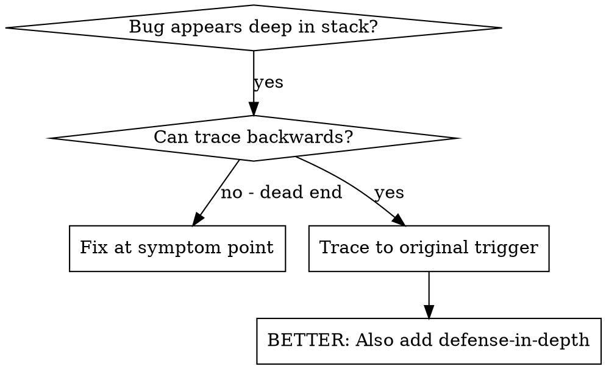
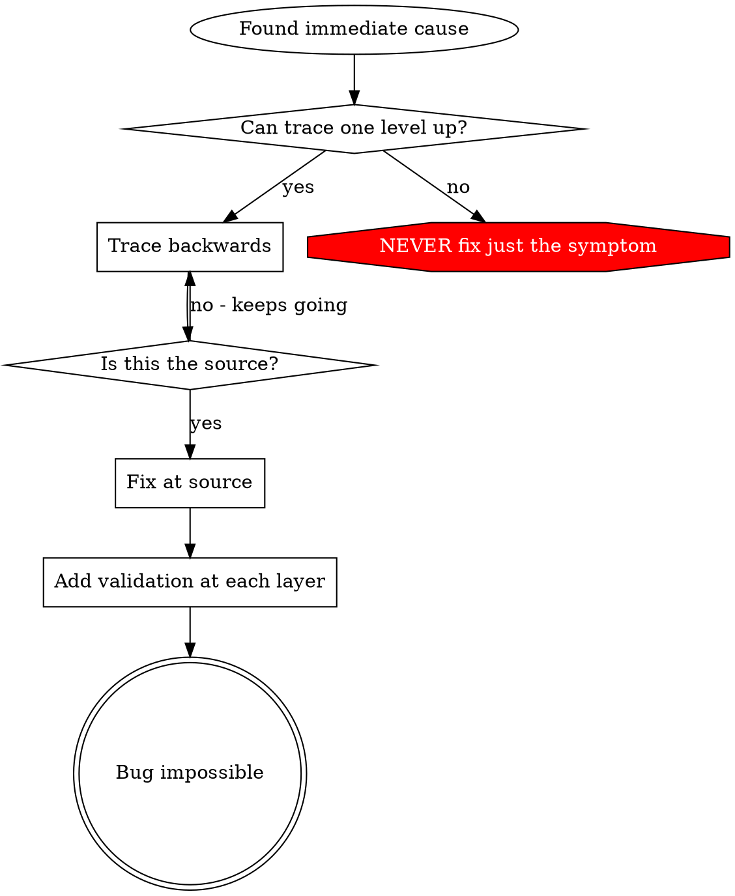
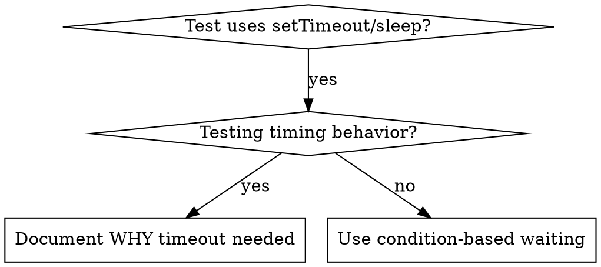

# Alloy Debug

This skill keeps Superpowers' root-cause discipline inline, including its supporting references, then layers Alloy's bounded retry and evidence requirements on top.

## Section 1: Superpowers Systematic Debugging (Alloy-normalized)

_Source: obra/superpowers v5.1.0 skills/systematic-debugging/SKILL.md (MIT)_

Note: retired Superpowers entrypoint names are normalized to current Alloy skills.

---
name: systematic-debugging
description: Use when encountering any bug, test failure, or unexpected behavior, before proposing fixes
---

# Systematic Debugging

## Overview

Random fixes waste time and create new bugs. Quick patches mask underlying issues.

**Core principle:** ALWAYS find root cause before attempting fixes. Symptom fixes are failure.

**Violating the letter of this process is violating the spirit of debugging.**

## The Iron Law

```
NO FIXES WITHOUT ROOT CAUSE INVESTIGATION FIRST
```

If you haven't completed Phase 1, you cannot propose fixes.

## When to Use

Use for ANY technical issue:
- Test failures
- Bugs in production
- Unexpected behavior
- Performance problems
- Build failures
- Integration issues

**Use this ESPECIALLY when:**
- Under time pressure (emergencies make guessing tempting)
- "Just one quick fix" seems obvious
- You've already tried multiple fixes
- Previous fix didn't work
- You don't fully understand the issue

**Don't skip when:**
- Issue seems simple (simple bugs have root causes too)
- You're in a hurry (rushing guarantees rework)
- Manager wants it fixed NOW (systematic is faster than thrashing)

## The Four Phases

You MUST complete each phase before proceeding to the next.

### Phase 1: Root Cause Investigation

**BEFORE attempting ANY fix:**

1. **Read Error Messages Carefully**
   - Don't skip past errors or warnings
   - They often contain the exact solution
   - Read stack traces completely
   - Note line numbers, file paths, error codes

2. **Reproduce Consistently**
   - Can you trigger it reliably?
   - What are the exact steps?
   - Does it happen every time?
   - If not reproducible → gather more data, don't guess

3. **Check Recent Changes**
   - What changed that could cause this?
   - Git diff, recent commits
   - New dependencies, config changes
   - Environmental differences

4. **Gather Evidence in Multi-Component Systems**

   **WHEN system has multiple components (CI → build → signing, API → service → database):**

   **BEFORE proposing fixes, add diagnostic instrumentation:**
   ```
   For EACH component boundary:
     - Log what data enters component
     - Log what data exits component
     - Verify environment/config propagation
     - Check state at each layer

   Run once to gather evidence showing WHERE it breaks
   THEN analyze evidence to identify failing component
   THEN investigate that specific component
   ```

   **Example (multi-layer system):**
   ```bash
   # Layer 1: Workflow
   echo "=== Secrets available in workflow: ==="
   echo "IDENTITY: ${IDENTITY:+SET}${IDENTITY:-UNSET}"

   # Layer 2: Build script
   echo "=== Env vars in build script: ==="
   env | grep IDENTITY || echo "IDENTITY not in environment"

   # Layer 3: Signing script
   echo "=== Keychain state: ==="
   security list-keychains
   security find-identity -v

   # Layer 4: Actual signing
   codesign --sign "$IDENTITY" --verbose=4 "$APP"
   ```

   **This reveals:** Which layer fails (secrets → workflow ✓, workflow → build ✗)

5. **Trace Data Flow**

   **WHEN error is deep in call stack:**

   See `root-cause-tracing.md` in this directory for the complete backward tracing technique.

   **Quick version:**
   - Where does bad value originate?
   - What called this with bad value?
   - Keep tracing up until you find the source
   - Fix at source, not at symptom

### Phase 2: Pattern Analysis

**Find the pattern before fixing:**

1. **Find Working Examples**
   - Locate similar working code in same codebase
   - What works that's similar to what's broken?

2. **Compare Against References**
   - If implementing pattern, read reference implementation COMPLETELY
   - Don't skim - read every line
   - Understand the pattern fully before applying

3. **Identify Differences**
   - What's different between working and broken?
   - List every difference, however small
   - Don't assume "that can't matter"

4. **Understand Dependencies**
   - What other components does this need?
   - What settings, config, environment?
   - What assumptions does it make?

### Phase 3: Hypothesis and Testing

**Scientific method:**

1. **Form Single Hypothesis**
   - State clearly: "I think X is the root cause because Y"
   - Write it down
   - Be specific, not vague

2. **Test Minimally**
   - Make the SMALLEST possible change to test hypothesis
   - One variable at a time
   - Don't fix multiple things at once

3. **Verify Before Continuing**
   - Did it work? Yes → Phase 4
   - Didn't work? Form NEW hypothesis
   - DON'T add more fixes on top

4. **When You Don't Know**
   - Say "I don't understand X"
   - Don't pretend to know
   - Ask for help
   - Research more

### Phase 4: Implementation

**Fix the root cause, not the symptom:**

1. **Create Failing Test Case**
   - Simplest possible reproduction
   - Automated test if possible
   - One-off test script if no framework
   - MUST have before fixing
   - Use the `alloy-tdd` skill for writing proper failing tests

2. **Implement Single Fix**
   - Address the root cause identified
   - ONE change at a time
   - No "while I'm here" improvements
   - No bundled refactoring

3. **Verify Fix**
   - Test passes now?
   - No other tests broken?
   - Issue actually resolved?

4. **If Fix Doesn't Work**
   - STOP
   - Count: How many fixes have you tried?
   - If < 3: Return to Phase 1, re-analyze with new information
   - **If ≥ 3: STOP and question the architecture (step 5 below)**
   - DON'T attempt Fix #4 without architectural discussion

5. **If 3+ Fixes Failed: Question Architecture**

   **Pattern indicating architectural problem:**
   - Each fix reveals new shared state/coupling/problem in different place
   - Fixes require "massive refactoring" to implement
   - Each fix creates new symptoms elsewhere

   **STOP and question fundamentals:**
   - Is this pattern fundamentally sound?
   - Are we "sticking with it through sheer inertia"?
   - Should we refactor architecture vs. continue fixing symptoms?

   **Discuss with your human partner before attempting more fixes**

   This is NOT a failed hypothesis - this is a wrong architecture.

## Red Flags - STOP and Follow Process

If you catch yourself thinking:
- "Quick fix for now, investigate later"
- "Just try changing X and see if it works"
- "Add multiple changes, run tests"
- "Skip the test, I'll manually verify"
- "It's probably X, let me fix that"
- "I don't fully understand but this might work"
- "Pattern says X but I'll adapt it differently"
- "Here are the main problems: [lists fixes without investigation]"
- Proposing solutions before tracing data flow
- **"One more fix attempt" (when already tried 2+)**
- **Each fix reveals new problem in different place**

**ALL of these mean: STOP. Return to Phase 1.**

**If 3+ fixes failed:** Question the architecture (see Phase 4.5)

## your human partner's Signals You're Doing It Wrong

**Watch for these redirections:**
- "Is that not happening?" - You assumed without verifying
- "Will it show us...?" - You should have added evidence gathering
- "Stop guessing" - You're proposing fixes without understanding
- "Ultrathink this" - Question fundamentals, not just symptoms
- "We're stuck?" (frustrated) - Your approach isn't working

**When you see these:** STOP. Return to Phase 1.

## Common Rationalizations

| Excuse | Reality |
|--------|---------|
| "Issue is simple, don't need process" | Simple issues have root causes too. Process is fast for simple bugs. |
| "Emergency, no time for process" | Systematic debugging is FASTER than guess-and-check thrashing. |
| "Just try this first, then investigate" | First fix sets the pattern. Do it right from the start. |
| "I'll write test after confirming fix works" | Untested fixes don't stick. Test first proves it. |
| "Multiple fixes at once saves time" | Can't isolate what worked. Causes new bugs. |
| "Reference too long, I'll adapt the pattern" | Partial understanding guarantees bugs. Read it completely. |
| "I see the problem, let me fix it" | Seeing symptoms ≠ understanding root cause. |
| "One more fix attempt" (after 2+ failures) | 3+ failures = architectural problem. Question pattern, don't fix again. |

## Quick Reference

| Phase | Key Activities | Success Criteria |
|-------|---------------|------------------|
| **1. Root Cause** | Read errors, reproduce, check changes, gather evidence | Understand WHAT and WHY |
| **2. Pattern** | Find working examples, compare | Identify differences |
| **3. Hypothesis** | Form theory, test minimally | Confirmed or new hypothesis |
| **4. Implementation** | Create test, fix, verify | Bug resolved, tests pass |

## When Process Reveals "No Root Cause"

If systematic investigation reveals issue is truly environmental, timing-dependent, or external:

1. You've completed the process
2. Document what you investigated
3. Implement appropriate handling (retry, timeout, error message)
4. Add monitoring/logging for future investigation

**But:** 95% of "no root cause" cases are incomplete investigation.

## Supporting Techniques

These techniques are part of systematic debugging and available in this directory:

- **`root-cause-tracing.md`** - Trace bugs backward through call stack to find original trigger
- **`defense-in-depth.md`** - Add validation at multiple layers after finding root cause
- **`condition-based-waiting.md`** - Replace arbitrary timeouts with condition polling

**Related skills:**
- **alloy-tdd** - For creating failing test case (Phase 4, Step 1)
- **superpowers:verification-before-completion** - Verify fix worked before claiming success

## Real-World Impact

From debugging sessions:
- Systematic approach: 15-30 minutes to fix
- Random fixes approach: 2-3 hours of thrashing
- First-time fix rate: 95% vs 40%
- New bugs introduced: Near zero vs common

## Section 2: root-cause-tracing reference (verbatim)

_Source: obra/superpowers v5.1.0 skills/systematic-debugging/root-cause-tracing.md (MIT); local backup universal/skills/alloy-debug/references/root-cause-tracing.md_

# Root Cause Tracing

## Overview

Bugs often manifest deep in the call stack (git init in wrong directory, file created in wrong location, database opened with wrong path). Your instinct is to fix where the error appears, but that's treating a symptom.

**Core principle:** Trace backward through the call chain until you find the original trigger, then fix at the source.

## When to Use



**Use when:**
- Error happens deep in execution (not at entry point)
- Stack trace shows long call chain
- Unclear where invalid data originated
- Need to find which test/code triggers the problem

## The Tracing Process

### 1. Observe the Symptom
```
Error: git init failed in ~/project/packages/core
```

### 2. Find Immediate Cause
**What code directly causes this?**
```typescript
await execFileAsync('git', ['init'], { cwd: projectDir });
```

### 3. Ask: What Called This?
```typescript
WorktreeManager.createSessionWorktree(projectDir, sessionId)
  → called by Session.initializeWorkspace()
  → called by Session.create()
  → called by test at Project.create()
```

### 4. Keep Tracing Up
**What value was passed?**
- `projectDir = ''` (empty string!)
- Empty string as `cwd` resolves to `process.cwd()`
- That's the source code directory!

### 5. Find Original Trigger
**Where did empty string come from?**
```typescript
const context = setupCoreTest(); // Returns { tempDir: '' }
Project.create('name', context.tempDir); // Accessed before beforeEach!
```

## Adding Stack Traces

When you can't trace manually, add instrumentation:

```typescript
// Before the problematic operation
async function gitInit(directory: string) {
  const stack = new Error().stack;
  console.error('DEBUG git init:', {
    directory,
    cwd: process.cwd(),
    nodeEnv: process.env.NODE_ENV,
    stack,
  });

  await execFileAsync('git', ['init'], { cwd: directory });
}
```

**Critical:** Use `console.error()` in tests (not logger - may not show)

**Run and capture:**
```bash
npm test 2>&1 | grep 'DEBUG git init'
```

**Analyze stack traces:**
- Look for test file names
- Find the line number triggering the call
- Identify the pattern (same test? same parameter?)

## Finding Which Test Causes Pollution

If something appears during tests but you don't know which test:

Use the bisection script `find-polluter.sh` in this directory:

```bash
./find-polluter.sh '.git' 'src/**/*.test.ts'
```

Runs tests one-by-one, stops at first polluter. See script for usage.

## Real Example: Empty projectDir

**Symptom:** `.git` created in `packages/core/` (source code)

**Trace chain:**
1. `git init` runs in `process.cwd()` ← empty cwd parameter
2. WorktreeManager called with empty projectDir
3. Session.create() passed empty string
4. Test accessed `context.tempDir` before beforeEach
5. setupCoreTest() returns `{ tempDir: '' }` initially

**Root cause:** Top-level variable initialization accessing empty value

**Fix:** Made tempDir a getter that throws if accessed before beforeEach

**Also added defense-in-depth:**
- Layer 1: Project.create() validates directory
- Layer 2: WorkspaceManager validates not empty
- Layer 3: NODE_ENV guard refuses git init outside tmpdir
- Layer 4: Stack trace logging before git init

## Key Principle



**NEVER fix just where the error appears.** Trace back to find the original trigger.

## Stack Trace Tips

**In tests:** Use `console.error()` not logger - logger may be suppressed
**Before operation:** Log before the dangerous operation, not after it fails
**Include context:** Directory, cwd, environment variables, timestamps
**Capture stack:** `new Error().stack` shows complete call chain

## Real-World Impact

From debugging session (2025-10-03):
- Found root cause through 5-level trace
- Fixed at source (getter validation)
- Added 4 layers of defense
- 1847 tests passed, zero pollution

## Section 3: defense-in-depth reference (verbatim)

_Source: obra/superpowers v5.1.0 skills/systematic-debugging/defense-in-depth.md (MIT); local backup universal/skills/alloy-debug/references/defense-in-depth.md_

# Defense-in-Depth Validation

## Overview

When you fix a bug caused by invalid data, adding validation at one place feels sufficient. But that single check can be bypassed by different code paths, refactoring, or mocks.

**Core principle:** Validate at EVERY layer data passes through. Make the bug structurally impossible.

## Why Multiple Layers

Single validation: "We fixed the bug"
Multiple layers: "We made the bug impossible"

Different layers catch different cases:
- Entry validation catches most bugs
- Business logic catches edge cases
- Environment guards prevent context-specific dangers
- Debug logging helps when other layers fail

## The Four Layers

### Layer 1: Entry Point Validation
**Purpose:** Reject obviously invalid input at API boundary

```typescript
function createProject(name: string, workingDirectory: string) {
  if (!workingDirectory || workingDirectory.trim() === '') {
    throw new Error('workingDirectory cannot be empty');
  }
  if (!existsSync(workingDirectory)) {
    throw new Error(`workingDirectory does not exist: ${workingDirectory}`);
  }
  if (!statSync(workingDirectory).isDirectory()) {
    throw new Error(`workingDirectory is not a directory: ${workingDirectory}`);
  }
  // ... proceed
}
```

### Layer 2: Business Logic Validation
**Purpose:** Ensure data makes sense for this operation

```typescript
function initializeWorkspace(projectDir: string, sessionId: string) {
  if (!projectDir) {
    throw new Error('projectDir required for workspace initialization');
  }
  // ... proceed
}
```

### Layer 3: Environment Guards
**Purpose:** Prevent dangerous operations in specific contexts

```typescript
async function gitInit(directory: string) {
  // In tests, refuse git init outside temp directories
  if (process.env.NODE_ENV === 'test') {
    const normalized = normalize(resolve(directory));
    const tmpDir = normalize(resolve(tmpdir()));

    if (!normalized.startsWith(tmpDir)) {
      throw new Error(
        `Refusing git init outside temp dir during tests: ${directory}`
      );
    }
  }
  // ... proceed
}
```

### Layer 4: Debug Instrumentation
**Purpose:** Capture context for forensics

```typescript
async function gitInit(directory: string) {
  const stack = new Error().stack;
  logger.debug('About to git init', {
    directory,
    cwd: process.cwd(),
    stack,
  });
  // ... proceed
}
```

## Applying the Pattern

When you find a bug:

1. **Trace the data flow** - Where does bad value originate? Where used?
2. **Map all checkpoints** - List every point data passes through
3. **Add validation at each layer** - Entry, business, environment, debug
4. **Test each layer** - Try to bypass layer 1, verify layer 2 catches it

## Example from Session

Bug: Empty `projectDir` caused `git init` in source code

**Data flow:**
1. Test setup → empty string
2. `Project.create(name, '')`
3. `WorkspaceManager.createWorkspace('')`
4. `git init` runs in `process.cwd()`

**Four layers added:**
- Layer 1: `Project.create()` validates not empty/exists/writable
- Layer 2: `WorkspaceManager` validates projectDir not empty
- Layer 3: `WorktreeManager` refuses git init outside tmpdir in tests
- Layer 4: Stack trace logging before git init

**Result:** All 1847 tests passed, bug impossible to reproduce

## Key Insight

All four layers were necessary. During testing, each layer caught bugs the others missed:
- Different code paths bypassed entry validation
- Mocks bypassed business logic checks
- Edge cases on different platforms needed environment guards
- Debug logging identified structural misuse

**Don't stop at one validation point.** Add checks at every layer.

## Section 4: condition-based-waiting reference (verbatim)

_Source: obra/superpowers v5.1.0 skills/systematic-debugging/condition-based-waiting.md (MIT); local backup universal/skills/alloy-debug/references/condition-based-waiting.md_

# Condition-Based Waiting

## Overview

Flaky tests often guess at timing with arbitrary delays. This creates race conditions where tests pass on fast machines but fail under load or in CI.

**Core principle:** Wait for the actual condition you care about, not a guess about how long it takes.

## When to Use



**Use when:**
- Tests have arbitrary delays (`setTimeout`, `sleep`, `time.sleep()`)
- Tests are flaky (pass sometimes, fail under load)
- Tests timeout when run in parallel
- Waiting for async operations to complete

**Don't use when:**
- Testing actual timing behavior (debounce, throttle intervals)
- Always document WHY if using arbitrary timeout

## Core Pattern

```typescript
// ❌ BEFORE: Guessing at timing
await new Promise(r => setTimeout(r, 50));
const result = getResult();
expect(result).toBeDefined();

// ✅ AFTER: Waiting for condition
await waitFor(() => getResult() !== undefined);
const result = getResult();
expect(result).toBeDefined();
```

## Quick Patterns

| Scenario | Pattern |
|----------|---------|
| Wait for event | `waitFor(() => events.find(e => e.type === 'DONE'))` |
| Wait for state | `waitFor(() => machine.state === 'ready')` |
| Wait for count | `waitFor(() => items.length >= 5)` |
| Wait for file | `waitFor(() => fs.existsSync(path))` |
| Complex condition | `waitFor(() => obj.ready && obj.value > 10)` |

## Implementation

Generic polling function:
```typescript
async function waitFor<T>(
  condition: () => T | undefined | null | false,
  description: string,
  timeoutMs = 5000
): Promise<T> {
  const startTime = Date.now();

  while (true) {
    const result = condition();
    if (result) return result;

    if (Date.now() - startTime > timeoutMs) {
      throw new Error(`Timeout waiting for ${description} after ${timeoutMs}ms`);
    }

    await new Promise(r => setTimeout(r, 10)); // Poll every 10ms
  }
}
```

See `condition-based-waiting-example.ts` in this directory for complete implementation with domain-specific helpers (`waitForEvent`, `waitForEventCount`, `waitForEventMatch`) from actual debugging session.

## Common Mistakes

**❌ Polling too fast:** `setTimeout(check, 1)` - wastes CPU
**✅ Fix:** Poll every 10ms

**❌ No timeout:** Loop forever if condition never met
**✅ Fix:** Always include timeout with clear error

**❌ Stale data:** Cache state before loop
**✅ Fix:** Call getter inside loop for fresh data

## When Arbitrary Timeout IS Correct

```typescript
// Tool ticks every 100ms - need 2 ticks to verify partial output
await waitForEvent(manager, 'TOOL_STARTED'); // First: wait for condition
await new Promise(r => setTimeout(r, 200));   // Then: wait for timed behavior
// 200ms = 2 ticks at 100ms intervals - documented and justified
```

**Requirements:**
1. First wait for triggering condition
2. Based on known timing (not guessing)
3. Comment explaining WHY

## Real-World Impact

From debugging session (2025-10-03):
- Fixed 15 flaky tests across 3 files
- Pass rate: 60% → 100%
- Execution time: 40% faster
- No more race conditions

## Section 5: condition-based-waiting example (verbatim)

_Source: obra/superpowers v5.1.0 skills/systematic-debugging/condition-based-waiting-example.ts (MIT); local backup universal/skills/alloy-debug/references/condition-based-waiting-example.ts_

// Complete implementation of condition-based waiting utilities
// From: Lace test infrastructure improvements (2025-10-03)
// Context: Fixed 15 flaky tests by replacing arbitrary timeouts

import type { ThreadManager } from '~/threads/thread-manager';
import type { LaceEvent, LaceEventType } from '~/threads/types';

/**
 * Wait for a specific event type to appear in thread
 *
 * @param threadManager - The thread manager to query
 * @param threadId - Thread to check for events
 * @param eventType - Type of event to wait for
 * @param timeoutMs - Maximum time to wait (default 5000ms)
 * @returns Promise resolving to the first matching event
 *
 * Example:
 *   await waitForEvent(threadManager, agentThreadId, 'TOOL_RESULT');
 */
export function waitForEvent(
  threadManager: ThreadManager,
  threadId: string,
  eventType: LaceEventType,
  timeoutMs = 5000
): Promise<LaceEvent> {
  return new Promise((resolve, reject) => {
    const startTime = Date.now();

    const check = () => {
      const events = threadManager.getEvents(threadId);
      const event = events.find((e) => e.type === eventType);

      if (event) {
        resolve(event);
      } else if (Date.now() - startTime > timeoutMs) {
        reject(new Error(`Timeout waiting for ${eventType} event after ${timeoutMs}ms`));
      } else {
        setTimeout(check, 10); // Poll every 10ms for efficiency
      }
    };

    check();
  });
}

/**
 * Wait for a specific number of events of a given type
 *
 * @param threadManager - The thread manager to query
 * @param threadId - Thread to check for events
 * @param eventType - Type of event to wait for
 * @param count - Number of events to wait for
 * @param timeoutMs - Maximum time to wait (default 5000ms)
 * @returns Promise resolving to all matching events once count is reached
 *
 * Example:
 *   // Wait for 2 AGENT_MESSAGE events (initial response + continuation)
 *   await waitForEventCount(threadManager, agentThreadId, 'AGENT_MESSAGE', 2);
 */
export function waitForEventCount(
  threadManager: ThreadManager,
  threadId: string,
  eventType: LaceEventType,
  count: number,
  timeoutMs = 5000
): Promise<LaceEvent[]> {
  return new Promise((resolve, reject) => {
    const startTime = Date.now();

    const check = () => {
      const events = threadManager.getEvents(threadId);
      const matchingEvents = events.filter((e) => e.type === eventType);

      if (matchingEvents.length >= count) {
        resolve(matchingEvents);
      } else if (Date.now() - startTime > timeoutMs) {
        reject(
          new Error(
            `Timeout waiting for ${count} ${eventType} events after ${timeoutMs}ms (got ${matchingEvents.length})`
          )
        );
      } else {
        setTimeout(check, 10);
      }
    };

    check();
  });
}

/**
 * Wait for an event matching a custom predicate
 * Useful when you need to check event data, not just type
 *
 * @param threadManager - The thread manager to query
 * @param threadId - Thread to check for events
 * @param predicate - Function that returns true when event matches
 * @param description - Human-readable description for error messages
 * @param timeoutMs - Maximum time to wait (default 5000ms)
 * @returns Promise resolving to the first matching event
 *
 * Example:
 *   // Wait for TOOL_RESULT with specific ID
 *   await waitForEventMatch(
 *     threadManager,
 *     agentThreadId,
 *     (e) => e.type === 'TOOL_RESULT' && e.data.id === 'call_123',
 *     'TOOL_RESULT with id=call_123'
 *   );
 */
export function waitForEventMatch(
  threadManager: ThreadManager,
  threadId: string,
  predicate: (event: LaceEvent) => boolean,
  description: string,
  timeoutMs = 5000
): Promise<LaceEvent> {
  return new Promise((resolve, reject) => {
    const startTime = Date.now();

    const check = () => {
      const events = threadManager.getEvents(threadId);
      const event = events.find(predicate);

      if (event) {
        resolve(event);
      } else if (Date.now() - startTime > timeoutMs) {
        reject(new Error(`Timeout waiting for ${description} after ${timeoutMs}ms`));
      } else {
        setTimeout(check, 10);
      }
    };

    check();
  });
}

// Usage example from actual debugging session:
//
// BEFORE (flaky):
// ---------------
// const messagePromise = agent.sendMessage('Execute tools');
// await new Promise(r => setTimeout(r, 300)); // Hope tools start in 300ms
// agent.abort();
// await messagePromise;
// await new Promise(r => setTimeout(r, 50));  // Hope results arrive in 50ms
// expect(toolResults.length).toBe(2);         // Fails randomly
//
// AFTER (reliable):
// ----------------
// const messagePromise = agent.sendMessage('Execute tools');
// await waitForEventCount(threadManager, threadId, 'TOOL_CALL', 2); // Wait for tools to start
// agent.abort();
// await messagePromise;
// await waitForEventCount(threadManager, threadId, 'TOOL_RESULT', 2); // Wait for results
// expect(toolResults.length).toBe(2); // Always succeeds
//
// Result: 60% pass rate → 100%, 40% faster execution

## Section 6: find-polluter script (verbatim)

_Source: obra/superpowers v5.1.0 skills/systematic-debugging/find-polluter.sh (MIT); local backup universal/skills/alloy-debug/references/find-polluter.sh_

#!/usr/bin/env bash
# Bisection script to find which test creates unwanted files/state
# Usage: ./find-polluter.sh <file_or_dir_to_check> <test_pattern>
# Example: ./find-polluter.sh '.git' 'src/**/*.test.ts'

set -e

if [ $# -ne 2 ]; then
  echo "Usage: $0 <file_to_check> <test_pattern>"
  echo "Example: $0 '.git' 'src/**/*.test.ts'"
  exit 1
fi

POLLUTION_CHECK="$1"
TEST_PATTERN="$2"

echo "🔍 Searching for test that creates: $POLLUTION_CHECK"
echo "Test pattern: $TEST_PATTERN"
echo ""

# Get list of test files
TEST_FILES=$(find . -path "$TEST_PATTERN" | sort)
TOTAL=$(echo "$TEST_FILES" | wc -l | tr -d ' ')

echo "Found $TOTAL test files"
echo ""

COUNT=0
for TEST_FILE in $TEST_FILES; do
  COUNT=$((COUNT + 1))

  # Skip if pollution already exists
  if [ -e "$POLLUTION_CHECK" ]; then
    echo "⚠️  Pollution already exists before test $COUNT/$TOTAL"
    echo "   Skipping: $TEST_FILE"
    continue
  fi

  echo "[$COUNT/$TOTAL] Testing: $TEST_FILE"

  # Run the test
  npm test "$TEST_FILE" > /dev/null 2>&1 || true

  # Check if pollution appeared
  if [ -e "$POLLUTION_CHECK" ]; then
    echo ""
    echo "🎯 FOUND POLLUTER!"
    echo "   Test: $TEST_FILE"
    echo "   Created: $POLLUTION_CHECK"
    echo ""
    echo "Pollution details:"
    ls -la "$POLLUTION_CHECK"
    echo ""
    echo "To investigate:"
    echo "  npm test $TEST_FILE    # Run just this test"
    echo "  cat $TEST_FILE         # Review test code"
    exit 1
  fi
done

echo ""
echo "✅ No polluter found - all tests clean!"
exit 0

## Alloy Integration Layer

_Source: Current Alloy alloy-debug/SKILL.md body before Task 7, MIT._

# Alloy Debug

## The Iron Law

```
NO FIXES WITHOUT ROOT CAUSE INVESTIGATION FIRST
```

Random fixes waste time and create new bugs. Quick patches mask underlying issues.

If you haven't completed Phase 1, you cannot propose fixes.

**Core principle:** ALWAYS find root cause before attempting fixes. Symptom fixes are failure.

## Roles (from GSD)

- **User = Reporter.** They describe symptoms, not causes.
- **Claude = Investigator.** Your job is to find the truth, not validate the reporter's hypothesis.

When the user says "I think it's X," treat it as data, not conclusion. Verify before acting.

## When to Use

Use for ANY technical issue:
- Test failures
- Bugs in production
- Unexpected behavior
- Performance problems
- Build failures
- Integration issues

**Use this ESPECIALLY when:**
- Under time pressure (emergencies make guessing tempting)
- "Just one quick fix" seems obvious
- You've already tried multiple fixes
- Previous fix didn't work
- You don't fully understand the issue

**Don't skip when:**
- Issue seems simple (simple bugs have root causes too)
- You're in a hurry (rushing guarantees rework)
- User wants it fixed NOW (systematic is faster than thrashing)

## The Four Phases

You MUST complete each phase before proceeding to the next.

### Phase 1: Root Cause Investigation

**BEFORE attempting ANY fix:**

1. **Read Error Messages Carefully**
   - Don't skip past errors or warnings
   - They often contain the exact solution
   - Read stack traces completely
   - Note line numbers, file paths, error codes

2. **Reproduce Consistently**
   - Can you trigger it reliably?
   - What are the exact steps?
   - Does it happen every time?
   - If not reproducible → gather more data, don't guess

3. **Check Recent Changes**
   - What changed that could cause this?
   - `git log --oneline -20`, `git diff <suspected>`
   - New dependencies, config changes
   - Environmental differences

4. **Gather Evidence in Multi-Component Systems**

   **WHEN system has multiple components** (CI → build → signing, API → service → database):

   Add diagnostic instrumentation BEFORE proposing fixes:
   ```
   For EACH component boundary:
     - Log what data enters component
     - Log what data exits component
     - Verify environment/config propagation
     - Check state at each layer

   Run once to gather evidence showing WHERE it breaks
   THEN analyze evidence to identify failing component
   THEN investigate that specific component
   ```

   Example (multi-layer signing system):
   ```bash
   # Layer 1: Workflow
   echo "=== Secrets available in workflow: ==="
   echo "IDENTITY: ${IDENTITY:+SET}${IDENTITY:-UNSET}"

   # Layer 2: Build script
   env | grep IDENTITY || echo "IDENTITY not in environment"

   # Layer 3: Signing script
   security list-keychains
   security find-identity -v

   # Layer 4: Actual signing
   codesign --sign "$IDENTITY" --verbose=4 "$APP"
   ```

   Reveals which layer fails (secrets → workflow ✓, workflow → build ✗).

5. **Trace Data Flow Backwards**

   **WHEN error is deep in call stack:**
   - Where does the bad value originate?
   - What called this with the bad value?
   - Keep tracing UP until you find the source.
   - Fix at source, not at symptom.

### Phase 2: Pattern Analysis

**Find the pattern before fixing:**

1. **Find Working Examples**
   - Locate similar working code in same codebase
   - What works that's similar to what's broken?

2. **Compare Against References**
   - If implementing a pattern, read reference implementation COMPLETELY
   - Don't skim — read every line
   - Understand the pattern fully before applying

3. **Identify Differences**
   - What's different between working and broken?
   - List every difference, however small
   - Don't assume "that can't matter"

4. **Understand Dependencies**
   - What other components does this need?
   - What settings, config, environment?
   - What assumptions does it make?

### Phase 3: Hypothesis and Testing

**Scientific method:**

1. **Form Single Hypothesis**
   - State clearly: "I think X is the root cause because Y."
   - Write it down. Be specific, not vague.

2. **Test Minimally**
   - Make the SMALLEST possible change to test the hypothesis
   - One variable at a time
   - Don't fix multiple things at once

3. **Verify Before Continuing**
   - Did it work? Yes → Phase 4
   - Didn't work? Form NEW hypothesis
   - DON'T add more fixes on top

4. **When You Don't Know**
   - Say "I don't understand X"
   - Don't pretend to know
   - Ask the user for help
   - Research more

### Phase 4: Implementation

**Fix the root cause, not the symptom:**

1. **Create Failing Test Case** (use `alloy-tdd`)
   - Simplest possible reproduction
   - Automated test if possible
   - One-off test script if no framework
   - MUST have before fixing

2. **Implement Single Fix**
   - Address the root cause identified
   - ONE change at a time
   - No "while I'm here" improvements
   - No bundled refactoring

3. **Verify Fix**
   - Test passes now?
   - No other tests broken?
   - Issue actually resolved?

4. **If Fix Doesn't Work**
   - STOP
   - Count: How many fixes have you tried?
   - If < 3: Return to Phase 1, re-analyze with new information
   - **If ≥ 3: STOP and question the architecture (step 5 below)**
   - DON'T attempt Fix #4 without architectural discussion

5. **If 3+ Fixes Failed: Question Architecture**

   Pattern indicating architectural problem:
   - Each fix reveals new shared state / coupling / problem in different place
   - Fixes require "massive refactoring" to implement
   - Each fix creates new symptoms elsewhere

   **STOP and question fundamentals:**
   - Is this pattern fundamentally sound?
   - Are we "sticking with it through sheer inertia"?
   - Should we refactor architecture vs. continue fixing symptoms?

   **Discuss with the user before attempting more fixes.**

   This is NOT a failed hypothesis — this is a wrong architecture.

## Red Flags — STOP and Follow Process

If you catch yourself thinking:
- "Quick fix for now, investigate later"
- "Just try changing X and see if it works"
- "Add multiple changes, run tests"
- "Skip the test, I'll manually verify"
- "It's probably X, let me fix that"
- "I don't fully understand but this might work"
- "Pattern says X but I'll adapt it differently"
- "Here are the main problems: [lists fixes without investigation]"
- Proposing solutions before tracing data flow
- **"One more fix attempt" (when already tried 2+)**
- **Each fix reveals new problem in different place**

**ALL of these mean: STOP. Return to Phase 1.**

## User Signals You're Doing It Wrong

**Watch for these redirections from the user:**

- "Is that not happening?" — You assumed without verifying
- "Will it show us…?" — You should have added evidence gathering
- "Stop guessing" — You're proposing fixes without understanding
- "Ultrathink this" — Question fundamentals, not just symptoms
- "We're stuck?" (frustrated) — Your approach isn't working

**When you see these:** STOP. Return to Phase 1.

## Common Rationalizations

| Excuse | Reality |
|--------|---------|
| "Issue is simple, don't need process" | Simple issues have root causes too. Process is fast for simple bugs. |
| "Emergency, no time for process" | Systematic debugging is FASTER than guess-and-check thrashing. |
| "Just try this first, then investigate" | First fix sets the pattern. Do it right from the start. |
| "I'll write test after confirming fix works" | Untested fixes don't stick. Test first proves it. |
| "Multiple fixes at once saves time" | Can't isolate what worked. Causes new bugs. |
| "Reference too long, I'll adapt the pattern" | Partial understanding guarantees bugs. Read it completely. |
| "I see the problem, let me fix it" | Seeing symptoms ≠ understanding root cause. |
| "One more fix attempt" (after 2+ failures) | 3+ failures = architectural problem. Question the pattern, don't fix again. |

## Quick Reference

| Phase | Key Activities | Success Criteria |
|-------|---------------|------------------|
| **1. Root Cause** | Read errors, reproduce, check changes, gather evidence | Understand WHAT and WHY |
| **2. Pattern** | Find working examples, compare | Identify differences |
| **3. Hypothesis** | Form theory, test minimally | Confirmed or new hypothesis |
| **4. Implementation** | Create test (alloy-tdd), fix, verify | Bug resolved, tests pass |

## When Process Reveals "No Root Cause"

If systematic investigation reveals issue is truly environmental, timing-dependent, or external:

1. You've completed the process
2. Document what you investigated in `.alloy/specs/<id>/findings.md`
3. Implement appropriate handling (retry, timeout, error message)
4. Add monitoring/logging for future investigation

**But:** 95% of "no root cause" cases are incomplete investigation.

## Evidence to Report

Each Phase should append to `.alloy/state/evidence.jsonl`:

```
alloy_evidence { kind: "investigation", summary: "Reproduced in N seconds, traced to layer X" }
alloy_evidence { kind: "hypothesis", summary: "Theory: X causes Y because Z" }
alloy_evidence { kind: "fix", summary: "Changed X. Test 'reproduces bug' now fails." }
alloy_evidence { kind: "verification", summary: "Full test suite passes, bug not reproducible." }
```

Then a regression test via `alloy-tdd` is mandatory for any code-affecting bug.

## Related Skills

- **alloy-tdd** — write the regression test (Phase 4, Step 1)
- **alloy-verify** — confirm the fix held before claiming done
- **alloy-map-codebase** — if the bug is in unfamiliar code, map first

## Real-World Impact

From debugging sessions:
- Systematic approach: 15–30 minutes to fix
- Random fixes approach: 2–3 hours of thrashing
- First-time fix rate: 95% vs. 40%
- New bugs introduced: near zero vs. common

## Deep references (load on-demand)

Sub-files in `references/` — read only when the main SKILL.md doesn't cover your specific debug situation.

- **`references/root-cause-tracing.md`** — Backward trace technique through call stack to find original trigger (SuperPower)
- **`references/defense-in-depth.md`** — Add validation at multiple layers after finding root cause (SuperPower)
- **`references/condition-based-waiting.md`** + **`condition-based-waiting-example.ts`** — Replace arbitrary timeouts with condition polling, runnable example (SuperPower)
- **`references/find-polluter.sh`** — Shell script to bisect-find a test that pollutes shared state (SuperPower)

## Attribution

Fuses:
- **obra/superpowers** systematic-debugging — 4 phases, Iron Law, multi-component instrumentation, 3-fix architectural gate, rationalization tables, plus 3 deep references + scripts vendored under `references/` (MIT)
- **GSD debugger framing** — User/Investigator roles, "ultrathink" signal
- **Alloy** — evidence integration, related-skill routing, dispatcher for alloy-tdd regression test

See `/CREDITS.md` at repo root for full attribution.

## Attribution

- obra/superpowers v5.1.0 `skills/systematic-debugging/SKILL.md` and references — MIT; inlined, with retired entrypoint names normalized to Alloy names where needed.
- Alloy current `alloy-debug` integration layer — MIT / first-party Alloy.

See `/CREDITS.md` at repo root for the full attribution chain.
