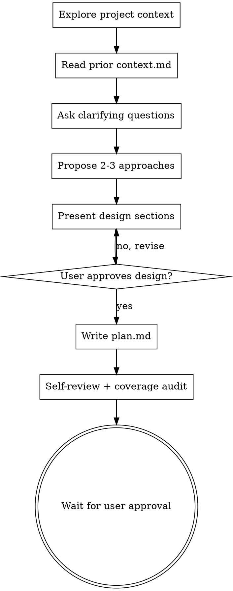

# Alloy Plan

Help turn ideas into fully formed implementation plans through natural collaborative dialogue.

This skill now owns the merged planning phase: clarify the request, shape the design, get design approval, then write the implementation-ready plan. The output is a single durable plan file under `.alloy/plans/<id>/plan.md`.

**Announce at start:** "Using `alloy-plan` to clarify the request and create the implementation plan."

**Save plans to:** `.alloy/plans/YYYY-MM-DD-<feature-name>/plan.md`

<HARD-GATE>
Do NOT invoke implementation skills, write production code, scaffold projects, or take implementation action until you have presented the design and the user has approved it.

After writing the plan, stop. The saved plan must have `approved: false` until the user explicitly approves it for `/execute`.
</HARD-GATE>

## Anti-Pattern: "This Is Too Simple To Need A Design"

Every project goes through this process. A todo list, a single-function utility, a config change, and a refactor all benefit from making the assumptions visible. The design can be short for simple work, but it still needs to exist and be approved before implementation.

## Checklist

You MUST complete these in order:

1. Explore project context: files, docs, `.alloy/plans/`, recent commits, and existing patterns.
2. Read `.alloy/plans/<id>/context.md` if `/discuss` already captured decisions.
3. Ask clarifying questions one at a time until purpose, constraints, and success criteria are clear.
4. Propose 2-3 approaches with trade-offs and a recommendation.
5. Present the design in sections scaled to complexity and get user approval.
6. Write `.alloy/plans/<id>/plan.md` with frontmatter and bite-sized implementation tasks.
7. Run the plan self-review and source coverage audit.
8. Stop and ask the user to approve the plan before `/execute`.

## Process Flow



## Understanding the Request

- Check current project state first: relevant files, docs, `.alloy/plans/`, recent commits, and existing patterns.
- Before detailed questions, assess scope. If the request describes multiple independent subsystems, flag that immediately and help decompose it.
- Ask questions one at a time.
- Prefer multiple choice when possible. Open-ended is fine when the user needs room to explain.
- Focus on purpose, constraints, success criteria, out-of-scope items, and user-visible behavior.
- Skip questions already answered by `context.md`, repo docs, or prior decisions.

## Exploring Approaches

Propose 2-3 concrete approaches with trade-offs. Lead with your recommended option and explain why.

Good approach comparisons are specific:

- What files or subsystems each option touches.
- What risk each option carries.
- What testing burden each option creates.
- What the option intentionally does not solve.

Avoid generic labels like "simple approach" or "robust approach" unless you explain the actual trade-off.

## Presenting the Design

Once you understand the work, present the design and get approval before writing the plan.

Scale the design to complexity:

- Small change: a few direct paragraphs.
- Medium feature: sections for architecture, files, data flow, error handling, and tests.
- Large feature: decompose into separate plans rather than forcing everything into one file.

Cover:

- Goal and non-goals.
- Components and file ownership.
- Data flow or control flow.
- Error handling and edge cases.
- Testing and verification strategy.

## Design for Isolation and Clarity

Break the system into smaller units that each have one clear purpose, communicate through well-defined interfaces, and can be understood and tested independently.

For each unit, answer:

- What does it do?
- How do you use it?
- What does it depend on?
- How will tests prove it works?

In existing codebases, follow established patterns. If the existing structure is messy, include only the targeted cleanup needed to make this change reliable.

## Scope Check

If the request spans multiple independent subsystems, suggest separate plans. Each plan should produce working, testable software on its own.

Do not silently absorb scope creep. Capture deferred ideas in `.alloy/deferred-ideas.md`:

```markdown
## Deferred from <feature>, captured <date>
- <topic> — brief description
```

## Plan File Frontmatter

Every plan file MUST start with frontmatter:

```yaml
---
id: <id>
approved: false
required_skills:
  - alloy-tdd
required_mcps: []
required_agents:
  - Architect
  - Builder
files_to_touch:
  - exact/path.ext
acceptance_criteria:
  - Observable criterion
---
```

Use real values. Do not leave placeholder arrays in the final plan.

## Plan Document Structure

Every `.alloy/plans/<id>/plan.md` MUST use this structure:

````markdown
---
id: <id>
approved: false
required_skills: [...]
required_mcps: [...]
required_agents: [...]
files_to_touch: [...]
acceptance_criteria: [...]
---

# <Feature Name>

## Why
<problem statement, current pain, scope>

## Design
<approved design summary>

## Acceptance Criteria
- <observable, testable criterion>

## Out of Scope
- <explicit non-goal>

## Plan

**For agentic workers:** REQUIRED SUB-SKILL — invoke `alloy-execute` to implement this plan task-by-task. Steps use checkbox (`- [ ]`) syntax for tracking.

**Goal:** [One sentence describing what this builds]

**Architecture:** [2-3 sentences about approach]

**Tech Stack:** [Key technologies / libraries]

---
````

## Bite-Sized Task Granularity

Each step is one action that takes roughly 2-5 minutes:

- "Write the failing test" is a step.
- "Run it to make sure it fails" is a step.
- "Implement the minimal code to make the test pass" is a step.
- "Run the tests and make sure they pass" is a step.
- "Commit" is a step.

## Task Structure

````markdown
### Task N: <Component Name>

**Files:**
- Create: `exact/path/to/file.py`
- Modify: `exact/path/to/existing.py:123`
- Test: `tests/exact/path/to/test.py`

- [ ] **Step 1: Write the failing test**

```python
def test_specific_behavior():
    result = function(input)
    assert result == expected
```

- [ ] **Step 2: Run test to verify it fails**

Run: `pytest tests/path/test.py::test_name -v`
Expected: FAIL with "function not defined"

- [ ] **Step 3: Write minimal implementation**

```python
def function(input):
    return expected
```

- [ ] **Step 4: Run test to verify it passes**

Run: `pytest tests/path/test.py::test_name -v`
Expected: PASS

- [ ] **Step 5: Commit**

```bash
git add tests/path/test.py src/path/file.py
git commit -m "feat: add specific feature"
```
````

## No Placeholders

Every step must contain the actual content an engineer needs. These are plan failures:

- "TBD", "TODO", "implement later", "fill in details"
- "Add appropriate error handling" or "add validation" without exact behavior
- "Write tests for the above" without actual test code
- "Similar to Task N" instead of repeating the necessary code
- References to types, functions, methods, commands, or files not defined in the plan

## Source Coverage Audit

After writing the plan, verify every design requirement maps to at least one task:

- For each acceptance criterion, identify the task that implements it.
- For each out-of-scope item, confirm no task implements it.
- For each file in `files_to_touch`, confirm at least one task names it.
- For each required skill, MCP, and agent, confirm the plan explains why it is needed.

Vocabulary blocklist — flag any task that says:

- "v1"
- "v2"
- "simplified version"
- "static for now"
- "placeholder"
- "stub"

If you find these, replace them with concrete implementation details or justify the scope reduction in `findings.md`.

## Self-Review

Before handing the plan to the user:

1. Placeholder scan: remove vague language and incomplete sections.
2. Type consistency: make sure names introduced in early tasks match later tasks.
3. Test quality: each behavioral change has a failing test or a concrete verification reason.
4. Command quality: each command is exact and has expected output.
5. Scope quality: no task implements something listed as out of scope.

Fix issues inline. Do not ask another agent to review unless the user requested delegation.

## Stack-Specific Guidance

Before finalizing, use relevant stack skills to validate task design:

- React/Next: `vercel-react-best-practices`, `next-best-practices`
- Kotlin/Spring: `kotlin-backend-jpa-entity-mapping`, `kotlin-springboot`
- PostgreSQL/jOOQ: `postgres`
- Terraform: `terraform-skill`

If a companion skill has a concrete constraint, embed it as a sub-step in the relevant task.

## Execution Handoff

After saving and self-reviewing the plan, stop:

> "Plan complete and saved to `.alloy/plans/<id>/plan.md` with `approved: false`. Please review it and set `approved: true` before `/execute`."

Do NOT invoke `alloy-execute` or `alloy-tdd` from here.

## Evidence

```
alloy_evidence { kind: "plan_done", taskId, summary: "Plan written with N tasks; coverage audit passed" }
```

`alloy gate check` for code tasks requires a plan with at least one task and user approval before execution can proceed.

## Attribution

Fuses:

- **obra/superpowers** brainstorming — HARD-GATE, natural collaborative dialogue, ask-one-question-at-a-time rule, design isolation principles, self-review (MIT)
- **obra/superpowers** writing-plans — bite-sized step format, no-placeholders rules, task structure template, self-review (MIT)
- **GSD** — source coverage audit, vocabulary blocklist
- **Alloy** — `.alloy/plans/<id>/plan.md` artifact convention, approval gate, stack companion routing, evidence integration, hand-off to alloy-execute
