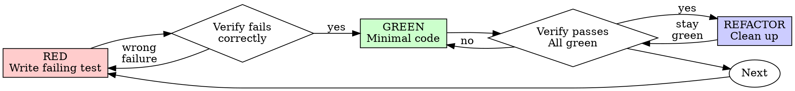
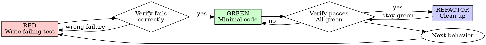

# Alloy TDD (inline-fused, 4 sources)

This skill intentionally inlines the full source material that Alloy fuses for TDD. Sections 1-7 are upstream reference material, Section 8 preserves Alloy's early Team TDD legacy with v0.1.2 dependency-name normalization, and Section 9 keeps Alloy's current integration layer.

## Section 1: Iron Law (from obra/superpowers v5.1.0, verbatim)

_Source: obra/superpowers v5.1.0 skills/test-driven-development/SKILL.md (MIT)_

---
name: test-driven-development
description: Use when implementing any feature or bugfix, before writing implementation code
---

# Test-Driven Development (TDD)

## Overview

Write the test first. Watch it fail. Write minimal code to pass.

**Core principle:** If you didn't watch the test fail, you don't know if it tests the right thing.

**Violating the letter of the rules is violating the spirit of the rules.**

## When to Use

**Always:**
- New features
- Bug fixes
- Refactoring
- Behavior changes

**Exceptions (ask your human partner):**
- Throwaway prototypes
- Generated code
- Configuration files

Thinking "skip TDD just this once"? Stop. That's rationalization.

## The Iron Law

```
NO PRODUCTION CODE WITHOUT A FAILING TEST FIRST
```

Write code before the test? Delete it. Start over.

**No exceptions:**
- Don't keep it as "reference"
- Don't "adapt" it while writing tests
- Don't look at it
- Delete means delete

Implement fresh from tests. Period.

## Red-Green-Refactor



### RED - Write Failing Test

Write one minimal test showing what should happen.

<Good>
```typescript
test('retries failed operations 3 times', async () => {
  let attempts = 0;
  const operation = () => {
    attempts++;
    if (attempts < 3) throw new Error('fail');
    return 'success';
  };

  const result = await retryOperation(operation);

  expect(result).toBe('success');
  expect(attempts).toBe(3);
});
```
Clear name, tests real behavior, one thing
</Good>

<Bad>
```typescript
test('retry works', async () => {
  const mock = jest.fn()
    .mockRejectedValueOnce(new Error())
    .mockRejectedValueOnce(new Error())
    .mockResolvedValueOnce('success');
  await retryOperation(mock);
  expect(mock).toHaveBeenCalledTimes(3);
});
```
Vague name, tests mock not code
</Bad>

**Requirements:**
- One behavior
- Clear name
- Real code (no mocks unless unavoidable)

### Verify RED - Watch It Fail

**MANDATORY. Never skip.**

```bash
npm test path/to/test.test.ts
```

Confirm:
- Test fails (not errors)
- Failure message is expected
- Fails because feature missing (not typos)

**Test passes?** You're testing existing behavior. Fix test.

**Test errors?** Fix error, re-run until it fails correctly.

### GREEN - Minimal Code

Write simplest code to pass the test.

<Good>
```typescript
async function retryOperation<T>(fn: () => Promise<T>): Promise<T> {
  for (let i = 0; i < 3; i++) {
    try {
      return await fn();
    } catch (e) {
      if (i === 2) throw e;
    }
  }
  throw new Error('unreachable');
}
```
Just enough to pass
</Good>

<Bad>
```typescript
async function retryOperation<T>(
  fn: () => Promise<T>,
  options?: {
    maxRetries?: number;
    backoff?: 'linear' | 'exponential';
    onRetry?: (attempt: number) => void;
  }
): Promise<T> {
  // YAGNI
}
```
Over-engineered
</Bad>

Don't add features, refactor other code, or "improve" beyond the test.

### Verify GREEN - Watch It Pass

**MANDATORY.**

```bash
npm test path/to/test.test.ts
```

Confirm:
- Test passes
- Other tests still pass
- Output pristine (no errors, warnings)

**Test fails?** Fix code, not test.

**Other tests fail?** Fix now.

### REFACTOR - Clean Up

After green only:
- Remove duplication
- Improve names
- Extract helpers

Keep tests green. Don't add behavior.

### Repeat

Next failing test for next feature.

## Good Tests

| Quality | Good | Bad |
|---------|------|-----|
| **Minimal** | One thing. "and" in name? Split it. | `test('validates email and domain and whitespace')` |
| **Clear** | Name describes behavior | `test('test1')` |
| **Shows intent** | Demonstrates desired API | Obscures what code should do |

## Why Order Matters

**"I'll write tests after to verify it works"**

Tests written after code pass immediately. Passing immediately proves nothing:
- Might test wrong thing
- Might test implementation, not behavior
- Might miss edge cases you forgot
- You never saw it catch the bug

Test-first forces you to see the test fail, proving it actually tests something.

**"I already manually tested all the edge cases"**

Manual testing is ad-hoc. You think you tested everything but:
- No record of what you tested
- Can't re-run when code changes
- Easy to forget cases under pressure
- "It worked when I tried it" ≠ comprehensive

Automated tests are systematic. They run the same way every time.

**"Deleting X hours of work is wasteful"**

Sunk cost fallacy. The time is already gone. Your choice now:
- Delete and rewrite with TDD (X more hours, high confidence)
- Keep it and add tests after (30 min, low confidence, likely bugs)

The "waste" is keeping code you can't trust. Working code without real tests is technical debt.

**"TDD is dogmatic, being pragmatic means adapting"**

TDD IS pragmatic:
- Finds bugs before commit (faster than debugging after)
- Prevents regressions (tests catch breaks immediately)
- Documents behavior (tests show how to use code)
- Enables refactoring (change freely, tests catch breaks)

"Pragmatic" shortcuts = debugging in production = slower.

**"Tests after achieve the same goals - it's spirit not ritual"**

No. Tests-after answer "What does this do?" Tests-first answer "What should this do?"

Tests-after are biased by your implementation. You test what you built, not what's required. You verify remembered edge cases, not discovered ones.

Tests-first force edge case discovery before implementing. Tests-after verify you remembered everything (you didn't).

30 minutes of tests after ≠ TDD. You get coverage, lose proof tests work.

## Common Rationalizations

| Excuse | Reality |
|--------|---------|
| "Too simple to test" | Simple code breaks. Test takes 30 seconds. |
| "I'll test after" | Tests passing immediately prove nothing. |
| "Tests after achieve same goals" | Tests-after = "what does this do?" Tests-first = "what should this do?" |
| "Already manually tested" | Ad-hoc ≠ systematic. No record, can't re-run. |
| "Deleting X hours is wasteful" | Sunk cost fallacy. Keeping unverified code is technical debt. |
| "Keep as reference, write tests first" | You'll adapt it. That's testing after. Delete means delete. |
| "Need to explore first" | Fine. Throw away exploration, start with TDD. |
| "Test hard = design unclear" | Listen to test. Hard to test = hard to use. |
| "TDD will slow me down" | TDD faster than debugging. Pragmatic = test-first. |
| "Manual test faster" | Manual doesn't prove edge cases. You'll re-test every change. |
| "Existing code has no tests" | You're improving it. Add tests for existing code. |

## Red Flags - STOP and Start Over

- Code before test
- Test after implementation
- Test passes immediately
- Can't explain why test failed
- Tests added "later"
- Rationalizing "just this once"
- "I already manually tested it"
- "Tests after achieve the same purpose"
- "It's about spirit not ritual"
- "Keep as reference" or "adapt existing code"
- "Already spent X hours, deleting is wasteful"
- "TDD is dogmatic, I'm being pragmatic"
- "This is different because..."

**All of these mean: Delete code. Start over with TDD.**

## Example: Bug Fix

**Bug:** Empty email accepted

**RED**
```typescript
test('rejects empty email', async () => {
  const result = await submitForm({ email: '' });
  expect(result.error).toBe('Email required');
});
```

**Verify RED**
```bash
$ npm test
FAIL: expected 'Email required', got undefined
```

**GREEN**
```typescript
function submitForm(data: FormData) {
  if (!data.email?.trim()) {
    return { error: 'Email required' };
  }
  // ...
}
```

**Verify GREEN**
```bash
$ npm test
PASS
```

**REFACTOR**
Extract validation for multiple fields if needed.

## Verification Checklist

Before marking work complete:

- [ ] Every new function/method has a test
- [ ] Watched each test fail before implementing
- [ ] Each test failed for expected reason (feature missing, not typo)
- [ ] Wrote minimal code to pass each test
- [ ] All tests pass
- [ ] Output pristine (no errors, warnings)
- [ ] Tests use real code (mocks only if unavoidable)
- [ ] Edge cases and errors covered

Can't check all boxes? You skipped TDD. Start over.

## When Stuck

| Problem | Solution |
|---------|----------|
| Don't know how to test | Write wished-for API. Write assertion first. Ask your human partner. |
| Test too complicated | Design too complicated. Simplify interface. |
| Must mock everything | Code too coupled. Use dependency injection. |
| Test setup huge | Extract helpers. Still complex? Simplify design. |

## Debugging Integration

Bug found? Write failing test reproducing it. Follow TDD cycle. Test proves fix and prevents regression.

Never fix bugs without a test.

## Testing Anti-Patterns

When adding mocks or test utilities, read @testing-anti-patterns.md to avoid common pitfalls:
- Testing mock behavior instead of real behavior
- Adding test-only methods to production classes
- Mocking without understanding dependencies

## Final Rule

```
Production code → test exists and failed first
Otherwise → not TDD
```

No exceptions without your human partner's permission.

## Section 2: testing-anti-patterns (from obra/superpowers v5.1.0, verbatim)

_Source: obra/superpowers v5.1.0 skills/test-driven-development/testing-anti-patterns.md (MIT)_

# Testing Anti-Patterns

**Load this reference when:** writing or changing tests, adding mocks, or tempted to add test-only methods to production code.

## Overview

Tests must verify real behavior, not mock behavior. Mocks are a means to isolate, not the thing being tested.

**Core principle:** Test what the code does, not what the mocks do.

**Following strict TDD prevents these anti-patterns.**

## The Iron Laws

```
1. NEVER test mock behavior
2. NEVER add test-only methods to production classes
3. NEVER mock without understanding dependencies
```

## Anti-Pattern 1: Testing Mock Behavior

**The violation:**
```typescript
// ❌ BAD: Testing that the mock exists
test('renders sidebar', () => {
  render(<Page />);
  expect(screen.getByTestId('sidebar-mock')).toBeInTheDocument();
});
```

**Why this is wrong:**
- You're verifying the mock works, not that the component works
- Test passes when mock is present, fails when it's not
- Tells you nothing about real behavior

**your human partner's correction:** "Are we testing the behavior of a mock?"

**The fix:**
```typescript
// ✅ GOOD: Test real component or don't mock it
test('renders sidebar', () => {
  render(<Page />);  // Don't mock sidebar
  expect(screen.getByRole('navigation')).toBeInTheDocument();
});

// OR if sidebar must be mocked for isolation:
// Don't assert on the mock - test Page's behavior with sidebar present
```

### Gate Function

```
BEFORE asserting on any mock element:
  Ask: "Am I testing real component behavior or just mock existence?"

  IF testing mock existence:
    STOP - Delete the assertion or unmock the component

  Test real behavior instead
```

## Anti-Pattern 2: Test-Only Methods in Production

**The violation:**
```typescript
// ❌ BAD: destroy() only used in tests
class Session {
  async destroy() {  // Looks like production API!
    await this._workspaceManager?.destroyWorkspace(this.id);
    // ... cleanup
  }
}

// In tests
afterEach(() => session.destroy());
```

**Why this is wrong:**
- Production class polluted with test-only code
- Dangerous if accidentally called in production
- Violates YAGNI and separation of concerns
- Confuses object lifecycle with entity lifecycle

**The fix:**
```typescript
// ✅ GOOD: Test utilities handle test cleanup
// Session has no destroy() - it's stateless in production

// In test-utils/
export async function cleanupSession(session: Session) {
  const workspace = session.getWorkspaceInfo();
  if (workspace) {
    await workspaceManager.destroyWorkspace(workspace.id);
  }
}

// In tests
afterEach(() => cleanupSession(session));
```

### Gate Function

```
BEFORE adding any method to production class:
  Ask: "Is this only used by tests?"

  IF yes:
    STOP - Don't add it
    Put it in test utilities instead

  Ask: "Does this class own this resource's lifecycle?"

  IF no:
    STOP - Wrong class for this method
```

## Anti-Pattern 3: Mocking Without Understanding

**The violation:**
```typescript
// ❌ BAD: Mock breaks test logic
test('detects duplicate server', () => {
  // Mock prevents config write that test depends on!
  vi.mock('ToolCatalog', () => ({
    discoverAndCacheTools: vi.fn().mockResolvedValue(undefined)
  }));

  await addServer(config);
  await addServer(config);  // Should throw - but won't!
});
```

**Why this is wrong:**
- Mocked method had side effect test depended on (writing config)
- Over-mocking to "be safe" breaks actual behavior
- Test passes for wrong reason or fails mysteriously

**The fix:**
```typescript
// ✅ GOOD: Mock at correct level
test('detects duplicate server', () => {
  // Mock the slow part, preserve behavior test needs
  vi.mock('MCPServerManager'); // Just mock slow server startup

  await addServer(config);  // Config written
  await addServer(config);  // Duplicate detected ✓
});
```

### Gate Function

```
BEFORE mocking any method:
  STOP - Don't mock yet

  1. Ask: "What side effects does the real method have?"
  2. Ask: "Does this test depend on any of those side effects?"
  3. Ask: "Do I fully understand what this test needs?"

  IF depends on side effects:
    Mock at lower level (the actual slow/external operation)
    OR use test doubles that preserve necessary behavior
    NOT the high-level method the test depends on

  IF unsure what test depends on:
    Run test with real implementation FIRST
    Observe what actually needs to happen
    THEN add minimal mocking at the right level

  Red flags:
    - "I'll mock this to be safe"
    - "This might be slow, better mock it"
    - Mocking without understanding the dependency chain
```

## Anti-Pattern 4: Incomplete Mocks

**The violation:**
```typescript
// ❌ BAD: Partial mock - only fields you think you need
const mockResponse = {
  status: 'success',
  data: { userId: '123', name: 'Alice' }
  // Missing: metadata that downstream code uses
};

// Later: breaks when code accesses response.metadata.requestId
```

**Why this is wrong:**
- **Partial mocks hide structural assumptions** - You only mocked fields you know about
- **Downstream code may depend on fields you didn't include** - Silent failures
- **Tests pass but integration fails** - Mock incomplete, real API complete
- **False confidence** - Test proves nothing about real behavior

**The Iron Rule:** Mock the COMPLETE data structure as it exists in reality, not just fields your immediate test uses.

**The fix:**
```typescript
// ✅ GOOD: Mirror real API completeness
const mockResponse = {
  status: 'success',
  data: { userId: '123', name: 'Alice' },
  metadata: { requestId: 'req-789', timestamp: 1234567890 }
  // All fields real API returns
};
```

### Gate Function

```
BEFORE creating mock responses:
  Check: "What fields does the real API response contain?"

  Actions:
    1. Examine actual API response from docs/examples
    2. Include ALL fields system might consume downstream
    3. Verify mock matches real response schema completely

  Critical:
    If you're creating a mock, you must understand the ENTIRE structure
    Partial mocks fail silently when code depends on omitted fields

  If uncertain: Include all documented fields
```

## Anti-Pattern 5: Integration Tests as Afterthought

**The violation:**
```
✅ Implementation complete
❌ No tests written
"Ready for testing"
```

**Why this is wrong:**
- Testing is part of implementation, not optional follow-up
- TDD would have caught this
- Can't claim complete without tests

**The fix:**
```
TDD cycle:
1. Write failing test
2. Implement to pass
3. Refactor
4. THEN claim complete
```

## When Mocks Become Too Complex

**Warning signs:**
- Mock setup longer than test logic
- Mocking everything to make test pass
- Mocks missing methods real components have
- Test breaks when mock changes

**your human partner's question:** "Do we need to be using a mock here?"

**Consider:** Integration tests with real components often simpler than complex mocks

## TDD Prevents These Anti-Patterns

**Why TDD helps:**
1. **Write test first** → Forces you to think about what you're actually testing
2. **Watch it fail** → Confirms test tests real behavior, not mocks
3. **Minimal implementation** → No test-only methods creep in
4. **Real dependencies** → You see what the test actually needs before mocking

**If you're testing mock behavior, you violated TDD** - you added mocks without watching test fail against real code first.

## Quick Reference

| Anti-Pattern | Fix |
|--------------|-----|
| Assert on mock elements | Test real component or unmock it |
| Test-only methods in production | Move to test utilities |
| Mock without understanding | Understand dependencies first, mock minimally |
| Incomplete mocks | Mirror real API completely |
| Tests as afterthought | TDD - tests first |
| Over-complex mocks | Consider integration tests |

## Red Flags

- Assertion checks for `*-mock` test IDs
- Methods only called in test files
- Mock setup is >50% of test
- Test fails when you remove mock
- Can't explain why mock is needed
- Mocking "just to be safe"

## The Bottom Line

**Mocks are tools to isolate, not things to test.**

If TDD reveals you're testing mock behavior, you've gone wrong.

Fix: Test real behavior or question why you're mocking at all.

## Section 3: Integration-style philosophy (from mattpocock/skills, verbatim)

_Source: mattpocock/skills skills/engineering/tdd/tests.md (MIT); local backup universal/skills/alloy-tdd/references/tests.md_

# Good and Bad Tests

## Good Tests

**Integration-style**: Test through real interfaces, not mocks of internal parts.

```typescript
// GOOD: Tests observable behavior
test("user can checkout with valid cart", async () => {
  const cart = createCart();
  cart.add(product);
  const result = await checkout(cart, paymentMethod);
  expect(result.status).toBe("confirmed");
});
```

Characteristics:

- Tests behavior users/callers care about
- Uses public API only
- Survives internal refactors
- Describes WHAT, not HOW
- One logical assertion per test

## Bad Tests

**Implementation-detail tests**: Coupled to internal structure.

```typescript
// BAD: Tests implementation details
test("checkout calls paymentService.process", async () => {
  const mockPayment = jest.mock(paymentService);
  await checkout(cart, payment);
  expect(mockPayment.process).toHaveBeenCalledWith(cart.total);
});
```

Red flags:

- Mocking internal collaborators
- Testing private methods
- Asserting on call counts/order
- Test breaks when refactoring without behavior change
- Test name describes HOW not WHAT
- Verifying through external means instead of interface

```typescript
// BAD: Bypasses interface to verify
test("createUser saves to database", async () => {
  await createUser({ name: "Alice" });
  const row = await db.query("SELECT * FROM users WHERE name = ?", ["Alice"]);
  expect(row).toBeDefined();
});

// GOOD: Verifies through interface
test("createUser makes user retrievable", async () => {
  const user = await createUser({ name: "Alice" });
  const retrieved = await getUser(user.id);
  expect(retrieved.name).toBe("Alice");
});
```

## Section 4: Mocking discipline (from mattpocock/skills, verbatim)

_Source: mattpocock/skills skills/engineering/tdd/mocking.md (MIT); local backup universal/skills/alloy-tdd/references/mocking.md_

# When to Mock

Mock at **system boundaries** only:

- External APIs (payment, email, etc.)
- Databases (sometimes - prefer test DB)
- Time/randomness
- File system (sometimes)

Don't mock:

- Your own classes/modules
- Internal collaborators
- Anything you control

## Designing for Mockability

At system boundaries, design interfaces that are easy to mock:

**1. Use dependency injection**

Pass external dependencies in rather than creating them internally:

```typescript
// Easy to mock
function processPayment(order, paymentClient) {
  return paymentClient.charge(order.total);
}

// Hard to mock
function processPayment(order) {
  const client = new StripeClient(process.env.STRIPE_KEY);
  return client.charge(order.total);
}
```

**2. Prefer SDK-style interfaces over generic fetchers**

Create specific functions for each external operation instead of one generic function with conditional logic:

```typescript
// GOOD: Each function is independently mockable
const api = {
  getUser: (id) => fetch(`/users/${id}`),
  getOrders: (userId) => fetch(`/users/${userId}/orders`),
  createOrder: (data) => fetch('/orders', { method: 'POST', body: data }),
};

// BAD: Mocking requires conditional logic inside the mock
const api = {
  fetch: (endpoint, options) => fetch(endpoint, options),
};
```

The SDK approach means:
- Each mock returns one specific shape
- No conditional logic in test setup
- Easier to see which endpoints a test exercises
- Type safety per endpoint

## Section 5: Deep modules (from mattpocock/skills, verbatim)

_Source: mattpocock/skills skills/engineering/tdd/deep-modules.md (MIT); local backup universal/skills/alloy-tdd/references/deep-modules.md_

# Deep Modules

From "A Philosophy of Software Design":

**Deep module** = small interface + lots of implementation

```
┌─────────────────────┐
│   Small Interface   │  ← Few methods, simple params
├─────────────────────┤
│                     │
│                     │
│  Deep Implementation│  ← Complex logic hidden
│                     │
│                     │
└─────────────────────┘
```

**Shallow module** = large interface + little implementation (avoid)

```
┌─────────────────────────────────┐
│       Large Interface           │  ← Many methods, complex params
├─────────────────────────────────┤
│  Thin Implementation            │  ← Just passes through
└─────────────────────────────────┘
```

When designing interfaces, ask:

- Can I reduce the number of methods?
- Can I simplify the parameters?
- Can I hide more complexity inside?

## Section 6: Interface design (from mattpocock/skills, verbatim)

_Source: mattpocock/skills skills/engineering/tdd/interface-design.md (MIT); local backup universal/skills/alloy-tdd/references/interface-design.md_

# Interface Design for Testability

Good interfaces make testing natural:

1. **Accept dependencies, don't create them**

   ```typescript
   // Testable
   function processOrder(order, paymentGateway) {}

   // Hard to test
   function processOrder(order) {
     const gateway = new StripeGateway();
   }
   ```

2. **Return results, don't produce side effects**

   ```typescript
   // Testable
   function calculateDiscount(cart): Discount {}

   // Hard to test
   function applyDiscount(cart): void {
     cart.total -= discount;
   }
   ```

3. **Small surface area**
   - Fewer methods = fewer tests needed
   - Fewer params = simpler test setup

## Section 7: Refactoring (from mattpocock/skills, verbatim)

_Source: mattpocock/skills skills/engineering/tdd/refactoring.md (MIT); local backup universal/skills/alloy-tdd/references/refactoring.md_

# Refactor Candidates

After TDD cycle, look for:

- **Duplication** → Extract function/class
- **Long methods** → Break into private helpers (keep tests on public interface)
- **Shallow modules** → Combine or deepen
- **Feature envy** → Move logic to where data lives
- **Primitive obsession** → Introduce value objects
- **Existing code** the new code reveals as problematic

## Section 8: Code constraints + Stack Companions routing (from Alloy Team TDD legacy)

_Source: alloy git history commit 60a9207, skills/team TDD/SKILL.md body, MIT_

Note: this section preserves the legacy body while normalizing retired dependency identifiers to current Alloy skill names so the v0.1.2 prompt-dependency audit remains green.

---
name: alloy-tdd
description: Team TDD skill. Invoke before any implementation. Combines superpowers iron law, mattpocock vertical slicing, and tech-stack specific constraints.
---

# Team TDD

## Iron Law (from superpowers)

NO PRODUCTION CODE WITHOUT A FAILING TEST FIRST.

Code written before tests → delete it. Not "keep as reference", not "adapt it". Delete and restart from test.

## Workflow (from mattpocock)

### 1. Design First
Before writing any code:
- Confirm with user: what interface changes needed?
- Confirm with user: which behaviors to test? (prioritize)
- List behaviors to test (NOT implementation steps)
- Get user approval

### 2. Vertical Slicing (NOT Horizontal)

WRONG: write all tests → write all code
RIGHT: one test → one implementation → repeat

Each cycle responds to what you learned from the previous one.

```
WRONG (horizontal):
  RED:   test1, test2, test3, test4, test5
  GREEN: impl1, impl2, impl3, impl4, impl5

RIGHT (vertical):
  RED→GREEN: test1→impl1
  RED→GREEN: test2→impl2
  RED→GREEN: test3→impl3
```

### 3. RED-GREEN-REFACTOR Cycle

**RED:** Write ONE test for ONE behavior
- Use the project's existing test runner
- Test name describes behavior: `test_<verb>_<scenario>_<expected>` or `"<verb>s <what> when <condition>"`
- Test uses public interface only
- Run → MUST fail (not error, fail)
- Classify: MISSING_BEHAVIOR (proceed) | TEST_BROKEN (fix test) | ENV_BROKEN (escalate)

**GREEN:** Write MINIMAL code to pass
- Only enough for THIS test
- Don't anticipate future tests
- Run → MUST pass. 3 failures → escalate.

**REFACTOR:** Clean up while tests stay green. Apply constraints below.

### 4. General Constraints (all languages)
- Functions: ≤10 lines (excluding signature). Extract if longer.
- Classes/Components: ≤50-100 lines. Split by responsibility.
- Files: ≤300 lines.
- Max 2 indentation levels (flatten with early return).
- Max 3 params per function → parameter object if more.
- Mock only at boundaries (DB/HTTP/external APIs).
- One test file per production module. Max 200 lines per test file.
- Factory functions for test data: `make_xxx()` / `createXxx()`
- Single responsibility per function/class/module.
- Early return. No else after return/raise/continue.

### 5. Per-Stack Rules (loaded via Orchestrator annotation)
- React/TS: load vercel-react-best-practices + next-best-practices + alloy-tdd
- Kotlin/Spring: load kotlin-backend-jpa-entity-mapping (JetBrains) + dr-jskill
- Terraform: load terraform-skill
- AWS: load awslabs agent-plugins
- Postgres: load postgres (Timescale)

### 6. Commit
- `git add <specific files>` (never -A)
- Atomic commit per RED→GREEN→REFACTOR cycle
- Message: `<type>(<scope>): <description>`

## Red Flags (from superpowers) — Require Code Deletion and Restart
- Writing code before tests
- Tests passing immediately without failing first
- Any rationalization for "just this once"
- Keeping previous code as reference
- Delayed test creation
- Adding tests post-implementation
- Claims about "spirit versus ritual"

## Checklist Per Cycle
- [ ] Test describes behavior, not implementation
- [ ] Test uses public interface only
- [ ] Test would survive internal refactor
- [ ] Test was observed FAILING before GREEN
- [ ] Code is minimal for this test
- [ ] No speculative features added
- [ ] Tech-stack constraints applied in REFACTOR
- [ ] Commit is atomic (one behavior per commit)

## Section 9: alloy v3 fusion + integration

_Source: Current Alloy alloy-tdd/SKILL.md body before Task 7, MIT_

# Alloy TDD

## The Iron Law

```
NO PRODUCTION CODE WITHOUT A FAILING TEST FIRST
```

Code written before tests → **delete it**. Not "keep as reference", not "adapt while writing tests", not "look at it". **Delete means delete.** Implement fresh from tests.

**Core principle:** If you didn't watch the test fail, you don't know if it tests the right thing.

**Violating the letter of the rules is violating the spirit of the rules.**

## When to Use

**Always:**
- New features
- Bug fixes
- Refactoring
- Behavior changes

**Exceptions** (ask user first):
- Throwaway prototypes
- Generated code
- Configuration files
- Pure documentation changes

Thinking "skip TDD just this once"? Stop. That's rationalization.

## Anti-Pattern: Horizontal Slicing

**DO NOT write all tests first, then all implementation.**

This is "horizontal slicing" — treating RED as "write all tests" and GREEN as "write all code." It produces **crap tests**:
- Tests written in bulk test *imagined* behavior, not *actual* behavior
- You end up testing the *shape* (data structures, signatures) rather than user-facing behavior
- Tests become insensitive to real changes
- You outrun your headlights, committing to test structure before understanding implementation

**Correct approach:** Vertical slicing via tracer bullets.

```
WRONG (horizontal):
  RED:   test1, test2, test3, test4, test5
  GREEN: impl1, impl2, impl3, impl4, impl5

RIGHT (vertical):
  RED→GREEN: test1→impl1
  RED→GREEN: test2→impl2
  RED→GREEN: test3→impl3
```

One test responds to what you learned from the previous cycle.

## Workflow

### 0. Design First

Before writing ANY code (test or impl):
- [ ] Confirm with user: what interface changes needed?
- [ ] Confirm with user: which behaviors to test (prioritize)?
- [ ] List behaviors to test (NOT implementation steps)
- [ ] Get user approval on the list

You can't test everything. Confirm what matters most. Focus on critical paths and complex logic, not every edge case.

### 1. Tracer Bullet

Write ONE test confirming ONE thing about the system:

```
RED:   Write test for first behavior → test fails
GREEN: Minimal code to pass → test passes
```

This is your tracer bullet — proves the path works end-to-end.

### 2. The Red-Green-Refactor Cycle



#### RED — Write Failing Test

Write one minimal test showing what should happen.

<Good>
```typescript
test('retries failed operations 3 times', async () => {
  let attempts = 0;
  const operation = () => {
    attempts++;
    if (attempts < 3) throw new Error('fail');
    return 'success';
  };
  const result = await retryOperation(operation);
  expect(result).toBe('success');
  expect(attempts).toBe(3);
});
```
Clear name, tests real behavior, one thing.
</Good>

<Bad>
```typescript
test('retry works', async () => {
  const mock = jest.fn()
    .mockRejectedValueOnce(new Error())
    .mockRejectedValueOnce(new Error())
    .mockResolvedValueOnce('success');
  await retryOperation(mock);
  expect(mock).toHaveBeenCalledTimes(3);
});
```
Vague name, tests mock not code.
</Bad>

**Requirements:**
- One behavior per test
- Clear name describing behavior and condition
- Real code (no mocks unless unavoidable boundary)

#### Verify RED — Watch It Fail

**MANDATORY. Never skip.**

Run the test. Classify the failure:

| Classification | Meaning | Action |
|---|---|---|
| `MISSING_BEHAVIOR` | Test fails because feature doesn't exist yet (expected) | Proceed to GREEN |
| `TEST_BROKEN` | Test fails due to typo / wrong assertion | Fix test, re-run |
| `ENV_BROKEN` | Test fails due to runner/env issue | Escalate |

**Test passes?** You're testing existing behavior. Fix the test to actually require new behavior.

**Test errors?** Fix error, re-run until it fails correctly.

#### GREEN — Minimal Code

Write the simplest code that passes the test.

<Good>
```typescript
async function retryOperation<T>(fn: () => Promise<T>): Promise<T> {
  for (let i = 0; i < 3; i++) {
    try { return await fn(); }
    catch (e) { if (i === 2) throw e; }
  }
  throw new Error('unreachable');
}
```
Just enough to pass.
</Good>

<Bad>
```typescript
async function retryOperation<T>(
  fn: () => Promise<T>,
  options?: { maxRetries?: number; backoff?: 'linear' | 'exponential'; onRetry?: (n: number) => void }
): Promise<T> { /* YAGNI */ }
```
Over-engineered. Speculative options.
</Bad>

Don't add features, don't refactor unrelated code, don't "improve" beyond the test. Run → MUST pass. **3 GREEN failures → escalate**.

#### Verify GREEN — Watch It Pass

**MANDATORY.** Run the test:
- Test passes ✓
- Other tests still pass ✓
- Output pristine (no errors/warnings) ✓

**Test fails?** Fix the code, not the test.
**Other tests fail?** Fix now — don't accumulate breakage.

#### REFACTOR — Clean Up

After GREEN only:
- Remove duplication
- Improve names
- Extract helpers

Keep tests green. Don't add behavior in REFACTOR.

#### Repeat

Next failing test for next behavior.

## Test Design

- **Test public behavior, not private implementation.** Tests should survive internal refactors.
- **Prefer real code over mocks.** Mock only external boundaries: network, database, filesystem, clocks, provider APIs.
- **Test names describe behavior + condition.** `test_<verb>_<scenario>_<expected>` or `"<verb>s <what> when <condition>"`.
- **One test → one failure reason.** "and" in the name? Split it.
- **Use existing project helpers** (factories, fixtures) before creating new ones.
- **Regression fixes include a test** that fails before the fix.

## Implementation Constraints (alloy-specific)

These apply universally during REFACTOR:

- **Functions ≤ 10 lines** (excluding signature). Extract if longer.
- **Classes/Components ≤ 50–100 lines**. Split by responsibility.
- **Files ≤ 300 lines**.
- **Max 2 indentation levels**. Flatten with early return.
- **Max 3 params per function** → use a parameter object if more.
- **Mock only at boundaries** (DB / HTTP / external APIs).
- **One test file per production module**, max 200 lines.
- **Factory functions for test data**: `make_xxx()` / `createXxx()`.
- **Single responsibility** per function/class/module.
- **Early return.** No `else` after `return` / `raise` / `continue`.

## Stack Companions

When `alloy-tdd` runs, dispatch to the stack-specific skill for additional constraints:

- **React / Next**: `vercel-react-best-practices`, `next-best-practices`
- **Kotlin / Spring**: `kotlin-backend-jpa-entity-mapping`, `sivalabs/spring-boot`
- **PostgreSQL / jOOQ**: `postgres`, `jooq-best-practices`
- **Terraform**: `terraform-skill`, `hashicorp/terraform-style-guide`
- **AWS**: `aws-agent-skills/{ecs,lambda,iam,secrets,cloudwatch,rds,s3}` as relevant

If a companion skill is missing, continue with project conventions and mention the missing optional skill in the final report.

## Commit Discipline

- `git add <specific files>` (never `git add -A`)
- **Atomic commit per RED→GREEN→REFACTOR cycle**
- Commit message: `<type>(<scope>): <description>`
- Tests + impl + refactor go in one commit; behavior changes don't mix with refactors

## Common Rationalizations

| Excuse | Reality |
|--------|---------|
| "Too simple to test" | Simple code breaks. Test takes 30 seconds. |
| "I'll test after" | Tests passing immediately prove nothing. |
| "Tests after achieve same goals" | Tests-after = "what does this do?" Tests-first = "what should this do?" |
| "Already manually tested" | Ad-hoc ≠ systematic. No record, can't re-run. |
| "Deleting X hours is wasteful" | Sunk cost fallacy. Keeping unverified code is technical debt. |
| "Keep as reference, write tests first" | You'll adapt it. That's testing after. Delete means delete. |
| "Need to explore first" | Fine. Throw away exploration, start with TDD. |
| "Test hard = design unclear" | Listen to the test. Hard to test = hard to use. |
| "TDD will slow me down" | TDD is faster than debugging. Pragmatic = test-first. |
| "Manual test faster" | Manual doesn't prove edge cases. You'll re-test every change. |
| "Existing code has no tests" | You're improving it. Add tests for existing code. |

## Red Flags — STOP and Start Over

- Code before test
- Test passes immediately without failing first
- Can't explain why the test failed
- Tests added "later"
- Rationalizing "just this once"
- Keeping previous code as "reference"
- Claims about "spirit versus ritual"

## Why Order Matters

**"I'll write tests after to verify it works"** — Tests-after pass immediately. Passing immediately proves nothing: might test wrong thing, might test implementation, might miss edge cases. Test-first forces you to see the test fail, proving it actually tests something.

**"Tests after achieve the same goals"** — No. Tests-after answer "what does this do?" Tests-first answer "what should this do?" Tests-after are biased by your implementation. Tests-first force edge-case discovery before implementing.

## Evidence to Report

For every implementation, the agent must record in `.alloy/state/evidence.jsonl`:
- The RED command and expected failure
- The GREEN command and passing result
- Any broader verification (lint, type check, e2e)
- Any unavailable optional companion skill

The plugin auto-logs tool calls; for explicit evidence use the `alloy_evidence` tool:

```
alloy_evidence {
  taskId: <current task>,
  kind: "tdd_red",
  summary: "Test 'retries 3 times' fails as expected",
  command: "npm test path/to/retry.test.ts"
}
```

Then for GREEN:
```
alloy_evidence { taskId, kind: "tdd_green", summary, command }
```

`alloy gate check` requires both `tdd_red` and `tdd_green` (or `test`) evidence for any task whose `kind=code`.

## Checklist Per Cycle

- [ ] Test describes behavior, not implementation
- [ ] Test uses public interface only
- [ ] Test would survive an internal refactor
- [ ] Test was observed FAILING before GREEN
- [ ] Code is minimal for this test (no speculative features)
- [ ] Tech-stack companion constraints applied in REFACTOR
- [ ] Commit is atomic (one behavior per commit)
- [ ] Evidence recorded via `alloy_evidence` for RED + GREEN

## Deep references (load on-demand for specific topics)

Sub-files in `references/` — read only when you need the depth. The main SKILL.md above covers 90% of cases.

- **`references/tests.md`** — Good vs Bad test examples, integration-style philosophy in concrete code (Matt Pocock)
- **`references/mocking.md`** — When to mock vs use real code, boundary identification (Matt Pocock)
- **`references/deep-modules.md`** — Small interface + deep implementation pattern, design for testability (Matt Pocock)
- **`references/interface-design.md`** — Public-API-first design, how good interfaces emerge from tests (Matt Pocock)
- **`references/refactoring.md`** — Safe refactoring under green tests (Matt Pocock)

Load these only when the SKILL.md doesn't answer your specific question. Most TDD work needs only the SKILL.md itself.

## Attribution

Fuses:
- **obra/superpowers** — Iron Law, RGR cycle, anti-rationalization table, Good/Bad examples (MIT)
- **mattpocock/skills** — Vertical slicing, design-first workflow, integration-style philosophy, plus 5 deep references vendored under `references/` (MIT)
- **Alloy first-party** — Stack Companions routing, evidence integration, code constraints (consolidated from earlier per-stack variants)

See `/CREDITS.md` at repo root for full attribution.

## Attribution

Inline-fused sources:

- obra/superpowers v5.1.0 `skills/test-driven-development/SKILL.md` and `testing-anti-patterns.md` — MIT; inlined as Sections 1-2.
- mattpocock/skills `skills/engineering/tdd/{tests,mocking,deep-modules,interface-design,refactoring}.md` — MIT; inlined as Sections 3-7 from the existing local `references/` backup.
- Alloy legacy Team TDD from git history commit `60a9207` — MIT / first-party Alloy; inlined as Section 8 with dependency-name normalization.
- Alloy v3 current `alloy-tdd` integration — MIT / first-party Alloy; inlined as Section 9.

See `/CREDITS.md` at repo root for the full attribution chain.
