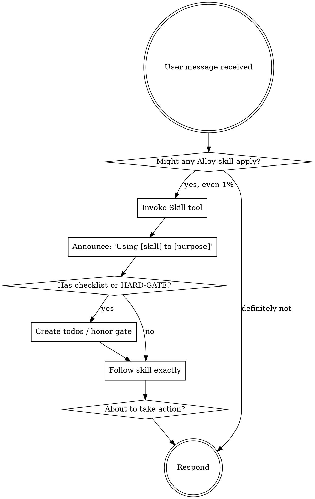

# Using Alloy

<SUBAGENT-STOP>
If you were dispatched as a subagent to execute a specific task, skip this skill.
</SUBAGENT-STOP>

<EXTREMELY-IMPORTANT>
If you think there is even a 1% chance an Alloy skill might apply to what you are doing, you ABSOLUTELY MUST invoke the skill.

IF A SKILL APPLIES TO YOUR TASK, YOU DO NOT HAVE A CHOICE. YOU MUST USE IT.

This is not negotiable. This is not optional. You cannot rationalize your way out of this.
</EXTREMELY-IMPORTANT>

## Instruction Priority

Alloy skills override default behavior, but **user instructions always take precedence**:

1. **User's explicit instructions** (CLAUDE.md, AGENTS.md, direct requests) — highest priority
2. **Alloy skills** — override default system behavior where they conflict
3. **Default behavior** — lowest priority

If CLAUDE.md says "don't use TDD" and `alloy-tdd` says "always TDD," follow CLAUDE.md.

## Where to Look for Skills

This repo has Alloy installed. Skills live in two places:

- **Global tier**: `~/.config/opencode/skills/` — available in every repo
- **Repo tier**: `<repo>/.opencode/skills/` — specific to this repo's scope

The active subset is in `<repo>/.opencode/alloy.manifest.json` under `visible[]`. You see only those in your `<available_skills>` block.

To discover skills not currently visible: `alloy list` or `alloy search <keyword>`. To activate: `alloy add <name>`.

## How to Invoke

Use the `Skill` tool. The content loads into your context — follow it directly. Never use Read on a SKILL.md file unless you're authoring skills.

# Using Skills — The Core Loop

**Invoke relevant skills BEFORE any response or action.** Even a 1% chance means check. If invoked wrongly, you don't have to follow it — but you must invoke first.



## Red Flags — STOP, You're Rationalizing

| Thought | Reality |
|---------|---------|
| "This is just a simple question" | Questions are tasks. Check for skills. |
| "I need more context first" | Skill check comes BEFORE clarifying questions. |
| "Let me explore the codebase first" | Skills tell you HOW to explore (alloy-map-codebase). Check first. |
| "I can grep/read this quickly" | Files lack conversation context. Check for skills. |
| "Let me gather information first" | Skills tell you HOW to gather. |
| "This doesn't need a formal skill" | If a skill exists, use it. |
| "I remember this skill" | Skills evolve. Read current version. |
| "This doesn't count as a task" | Action = task. Check for skills. |
| "The skill is overkill" | Simple things become complex. Use it. |
| "I'll just do this one thing first" | Check BEFORE doing anything. |
| "This feels productive" | Undisciplined action wastes time. Skills prevent this. |
| "I know what this means" | Knowing concept ≠ using skill. Invoke it. |

## Alloy Skill Priority

When multiple skills could apply, use this order:

1. **Process skills first** — alloy-plan, alloy-debug, alloy-discuss decide HOW to approach.
2. **Implementation skills second** — alloy-tdd and alloy-execute carry out the work.
3. **Quality skills last** — alloy-verify, alloy-review gate the completion.

"Let's build X" → `alloy-plan` first, then `alloy-execute`.
"Fix this bug" → `alloy-debug` first, then `alloy-tdd` for regression test.
"Stress-test my plan" → `grill-me` or `grill-with-docs` (Matt Pocock skills, vendored).

## Skill Types

**Rigid** (alloy-tdd, alloy-debug, alloy-verify): Follow exactly. Don't adapt away discipline.

**Flexible** (alloy-discuss, alloy-plan): Adapt principles to context.

The skill itself tells you which via its frontmatter and HARD-GATE blocks.

## The 3-Phase Workflow

Alloy organizes work into 3 phases. Most non-trivial tasks should flow through them:

```
Plan phase  →  Execute phase  →  Verify phase
   (/plan)        (/execute)        (/verify)

  alloy-plan      alloy-execute     alloy-verify
  alloy-discuss   alloy-tdd         alloy-review
  alloy-debug                      alloy-respond-review
```

For ad-hoc work (typo fix, single-file edit), you can skip the phase ceremony. For anything multi-step, run the phases.

## Evidence Trail

Alloy records work in `.alloy/state/*.jsonl`:
- `tasks.jsonl` — what you set out to do
- `evidence.jsonl` — what you actually did (one record per significant tool call, automatically logged by the plugin)
- `claims.jsonl` — what you claim is done (must bind to evidence)
- `runs.jsonl` — every event

You don't write these directly. The Alloy plugin auto-records on tool calls. Use the `alloy_evidence`, `alloy_claim`, `alloy_state`, `alloy_gate` tools when you need to add explicit records.

When in doubt about whether you've actually completed something: ask `alloy gate check`.

## User Instructions Override

User says WHAT, not always HOW. "Add X" or "Fix Y" doesn't mean skip workflows. But if user says "skip the planning, just code it" — honor that. Skills are defaults, not laws.
